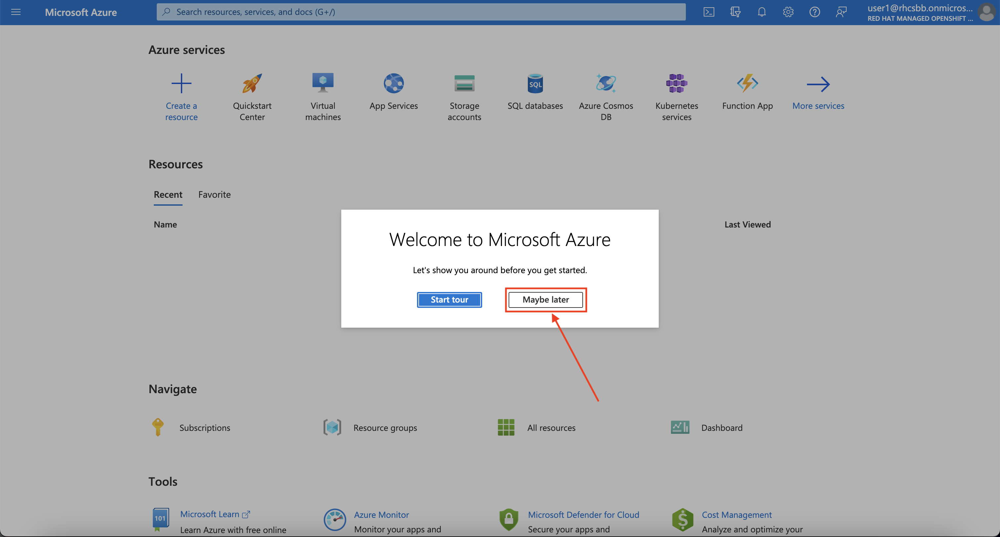
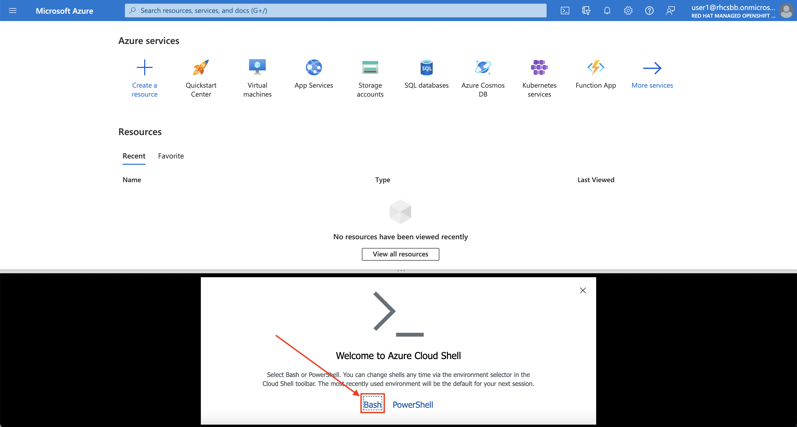
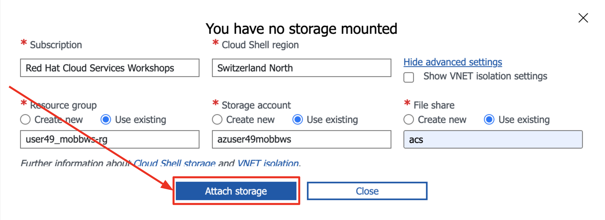
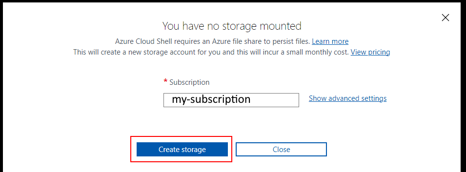

## The Workshop Environment You Are Using


Your workshop environment consists of several components which have been pre-configured and are ready to use. This includes a [Microsoft Azure](https://azure.microsoft.com/en-us/){:target="_blank"} account, an [Azure Red Hat OpenShift](https://azure.microsoft.com/en-us/products/openshift/){:target="_blank"} cluster, and many other supporting resources.


Click through to the [Credentials document]({{ credentials_doc }}){:target="_blank"} and claim a username/password by putting your name next to it in the **Participant** column.


To access your working environment, you'll need to log into the [Microsoft Azure portal](https://portal.azure.com){:target="_blank"}.  Use your provided username with `@rhcsbb.onmicrosoft.com`. If you use the Azure portal regularly and it already knows a set of credentials for you, it's probably a good idea to use an Incognito window for this task, it should obviate the need to log out of an existing session.

When prompted, you'll log in with the credentials provided by the workshop team.

!!! warning "Log out of existing Microsoft Azure sessions"

    While these commands can be run in any Microsoft Azure account, we've completed many of the prerequisites for you to ensure they work in the workshop environment. As such, we recommend ensuring that you are logged out of any other Microsoft Azure sessions.

### Pre-created Resources

- Resource Group
- vNet (with two subnets)
- Azure AD Service Principal
- Azure Red Hat OpenShift Cluster

!!! info "This is a self driven workshop that will lead you through learning how to Deploy and Use an ARO cluster.  If you are at a Red Hat led workshop, ensure that you are accessing this workshop from the URL provided by the Red Hat team as it may have important differences."

### Azure Requirements

Azure Red Hat OpenShift requires a minimum of 40 cores to create and run an OpenShift cluster. The default Azure resource quota for a new Azure subscription is 10 and does not meet this requirement. Therefore, you have to increase your quota from 10 to a minimum of 40. To request an increase in your resource limit, please consult the Microsoft document titled [Increase VM-family vCPU](https://docs.microsoft.com/en-us/azure/azure-portal/supportability/per-vm-quota-requests){:target="_blank"} quotas.

You can verify your quota with the following command (change `eastus` to match the Azure Region you plan on deploying to).

```bash
az vm list-usage -l eastus \
    --query "[?contains(name.value, 'standardDSv3Family')]" \
    -o table
```

### Red Hat Requirements

In order to Create a cluster with access to OperatorHub (needed for this workshop) you need to Log into the Red Hat cloud console and download a Pull Secret.

1. Login to [https://console.redhat.com/openshift/downloads#tool-pull-secret](https://console.redhat.com/openshift/downloads#tool-pull-secret) your Red Hat credentials (if you do not have an account you can create one from here).

1. hit the `Download` button and download it to a known location. This workshop assumes the pull secret will be in `{{ workshop_dir }}/pull-secret.txt`.

<!--
### Local Environment Setup

In order to complete this workshop you will need access to the Azure Portal and Azure APIs,  You will also need access to several websites such as GitHub and you will need to be able to access the Cluster's API and Console.  In general if you can browse any HTTPS (:443) site and can also access a the OpenShift API default port (:6443) you should be safe to run this workshop on your local machine.

If you do not meet these requirements, or you have a Windows (without WSL2) workstation you should consider using Azure Cloud Shell as described below.
-->


#### Azure Cloud Shell

Azure Cloud Shell is an interactive, authenticated, browser-accessible shell for managing Azure resources. In this workshop, we'll use Azure Cloud Shell extensively to execute commands.

1. Log into the [Azure Portal](https://portal.azure.com){:target="_blank"}

1. If this is your first time logging in you can skip the tour of the Azure Portal by clicking the *Maybe Later* button.

    { align=center }

1. To start Azure Cloud Shell, click on the `>_` button at the top right corner of the Azure Portal.

    { align=center }

1. Once prompted, select *Bash* from the *Welcome* screen.

    { align=center }


1. On the next screen, you'll receive a message that says "You have no storage mounted". Select the *Show advanced settings* link.

    { align=center }

1. While we've pre-created a number of resources, including a storage account for you to use with Azure Cloud Shell, you'll need to configure Azure Cloud Shell using the table below.

    | Option     | Value                               | Example |
    | ----------- | ------------------------------------ | -------- |
    | Subscription       | **Red Hat Cloud Services Workshops**  | N/A |
    | Cloud Shell region       | **eastus**                 | N/A |
    | Show VNET isolation settings    | *Leave Unchecked* | N/A |
    | Resource group       | **cloudshell** (Select *Use Existing* Button) | **cloudshell** |
    | Storage account       | **workshop#####** (Select *Use Existing* Button) | **workshop9befafc2** |
    | File share       | **user#** (Select *Use Existing* Button) | **user0** |

1. Once completed, click on the *Attach Storage* button to start your Azure Cloud Shell session.

    { align=center }

1. On the next screen, you'll receive a message that says "You have no storage mounted". Make sure the Subscription is correct and hit the **Create storage** button.

{ align=center }



1. Run any CLI commands provided in this Workshop inside your Cloud Shell prompt.

#### Configure your local environment

When your shell is ready and you are at the bash prompt, run the following commands to prepare your Cloud Shell environment for the remainder of the workshop

1. Create a directory to work from

    ```bash
    mkdir -p {{ workshop_dir }}
    cd {{ workshop_dir }}
    ```



1. Run the prepared workshop setup script

    ```bash
    ~/clouddrive/setup.sh
    ```

1. Download the prepared workshop setup script

    ```bash
    wget https://ws.mobb.cloud/assets/cloudshell-setup.sh
    ```

1. Check the newly downloaded `cloudshell-setup.sh` file. Likely the defaults will be sufficient, but you may want to change the `AZ_LOCATION` to match your preferred Azure Region. When you're happy wil it, run it to set up your environment.

    ```bash
    bash ./cloudshell-setup.sh
    ```


    !!! warning "You will see a significant amount of output as the script prepares your environment for the workshop."

1. The above setup script will save a file in your home directory containing a set of environment variables. Source this file any time you start a new terminal, or if you're in Azure Cloud Shell consider adding this line to your `~/.bashrc` file.

    ```bash
    . ~/.workshoprc
    ```
