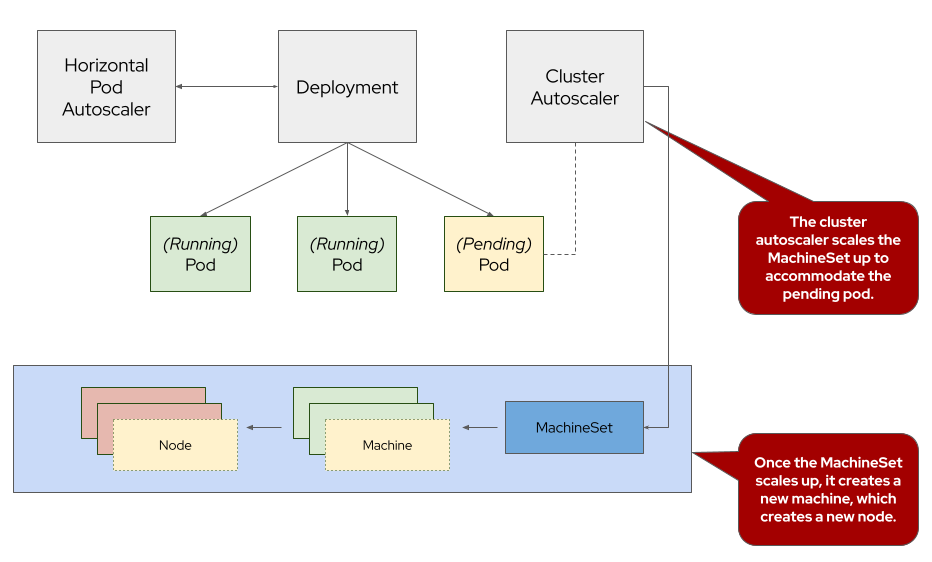

## Introduction

ARO Cluster Autoscaler is a feature that helps automatically adjust the size of an ARO cluster based on the current workload and resource demands. Cluster Autoscaler offers automatic and intelligent scaling of ARO clusters, leading to efficient resource utilization, improved application performance, high availability, and simplified cluster management. By dynamically adjusting the cluster size based on workload demands, it helps organizations optimize their infrastructure costs while ensuring optimal application performance and scalability. The cluster autoscaler does not increase the cluster resources beyond the limits that you specify.

{ align=center }

To learn more about cluster autoscaling, visit the [Red Hat documentation for cluster autoscaling](https://docs.openshift.com/container-platform/latest/machine_management/applying-autoscaling.html){:target="_blank"}.

## Create a Machine Autoscaler

Before we can configure cluster autoscaling, we first need to configure machine autoscaler to scale each of our MachineSets. While this can be accomplished via the OpenShift Web Console or OpenShift CLI tools, we'll be using the CLI for this part of the workshop.

1. Just like the last section, let's pick a MachineSet to add a machine autoscaler. To do so, run the following command:

    ```bash
    MACHINESET=$(oc -n openshift-machine-api get machinesets -o name \
      | cut -d / -f2 | head -1)
    echo ${MACHINESET}
    ```

1. Next, let's use that information to populate a manifest to create a machine autoscaler. To do so, run the following command:

    ```yaml
    cat <<EOF | oc apply -f -
    apiVersion: "autoscaling.openshift.io/v1beta1"
    kind: "MachineAutoscaler"
    metadata:
      name: "${MACHINESET}"
      namespace: "openshift-machine-api"
    spec:
      minReplicas: 1
      maxReplicas: 3
      scaleTargetRef:
        apiVersion: machine.openshift.io/v1beta1
        kind: MachineSet
        name: "${MACHINESET}"
    EOF
    ```

    The output of the command will look something like:

    ```{.text .no-copy}
    machineautoscaler.autoscaling.openshift.io/user1-cluster-8kvh4-worker-{{ azure_region }}1 created
    ```

1. Next, let's check to see that our machine autoscaler has been created. To do so, run the following command:

    ```bash
    oc -n openshift-machine-api get machineautoscaler
    ```

    You should see output similar to:

    ```{.text .no-copy}
    NAME                                 REF KIND     REF NAME                             MIN   MAX   AGE
    user1-cluster-8kvh4-worker-{{ azure_region }}1   MachineSet   user1-cluster-8kvh4-worker-{{ azure_region }}1   1     3     3m11s
    ```

## Create a Cluster Autoscaler

1. Next, we need to create the cluster autoscaler resource. To do so, run the following command:

    ```yaml
    cat <<EOF | oc apply -f -
    apiVersion: "autoscaling.openshift.io/v1"
    kind: "ClusterAutoscaler"
    metadata:
      name: "default"
    spec:
      podPriorityThreshold: -10
      resourceLimits:
        maxNodesTotal: 10
        cores:
          min: 8
          max: 128
        memory:
          min: 4
          max: 256
      scaleDown:
        enabled: true
        delayAfterAdd: 2m
        delayAfterDelete: 1m
        delayAfterFailure: 15s
        unneededTime: 1m
    EOF
    ```

1. Next, let's check to see that our cluster autoscaler has been created. To do so, run the following command:

    ```bash
    oc -n openshift-machine-api get clusterautoscaler
    ```

    You should see output similar to:

    ```{.text .no-copy}
    NAME      AGE
    default   3m
    ```

    For a detailed explanation of each parameter, see the [Red Hat documentation on the cluster autoscaler](https://docs.openshift.com/container-platform/latest/machine_management/applying-autoscaling.html#cluster-autoscaler-cr_applying-autoscaling){:target="_blank"}.

## Test the Cluster Autoscaler

Now let's test the cluster autoscaler and see it in action. To do so, we'll deploy a job with a load that this cluster cannot handle. This should force the cluster to scale to handle the load.

1. First, let's create a namespace (also known as a project in OpenShift). To do so, run the following command:

    ```bash
    oc new-project autoscale-ex
    ```

1. Next, let's deploy our job that will exhaust the cluster's resources and cause it to scale more worker nodes. To do so, run the following command:

    ```yaml
    cat << EOF | oc create -f -
    apiVersion: batch/v1
    kind: Job
    metadata:
      generateName: maxscale
    spec:
      template:
        spec:
          containers:
          - name: work
            image: busybox
            command: ["sleep",  "300"]
            resources:
              requests:
                memory: 500Mi
                cpu: 500m
          restartPolicy: Never
      backoffLimit: 4
      completions: 50
      parallelism: 50
    EOF
    ```

1. After a few seconds, run the following to see what pods have been created.

    ```bash
    oc -n autoscale-ex get pods
    ```

    Your output will look something like this:

    ```{.text .no-copy}
    NAME                     READY   STATUS    RESTARTS   AGE
    maxscale-2bdjf   0/1     Pending   0          2s
    maxscale-2tvd6   0/1     Pending   0          2s
    maxscale-48rt7   0/1     Pending   0          2s
    maxscale-4nmch   0/1     Pending   0          2s
    maxscale-4zpnf   0/1     Pending   0          2s
    [...]
    ```

    Notice that we see a lot of pods in a pending state.  This should trigger the cluster autoscaler to create more machines using the MachineAutoscaler we created.


1. Let's check to see if our MachineSet automatically scaled. To do so, run the following command:

    ```bash
    oc -n openshift-machine-api get machinesets
    ```

    You should see output similar to:

    ```{.text .no-copy}
    NAME                                 DESIRED   CURRENT   READY   AVAILABLE   AGE
    user1-cluster-8kvh4-worker-{{ azure_region }}1   3         3         3       3           6h47m
    user1-cluster-8kvh4-worker-{{ azure_region }}2   1         1         1       1           6h47m
    user1-cluster-8kvh4-worker-{{ azure_region }}3   1         1         1       1           6h47m
    ```

    !!! info "If you see READY and AVAILABLE at 1 still, don't panic! It can take a few minutes for the workers to instantiate. Try checking again after 3-5 minutes."

    This shows that the cluster autoscaler is working on scaling the MachineSet up to 3.

1. Now let's watch the cluster autoscaler create and delete machines as necessary. To do so, run the following command:

    ```bash
    watch ~/bin/oc -n openshift-machine-api get machines \
      -l "machine.openshift.io/cluster-api-machine-role=worker"
    ```

    Your output will look like this:

    ```{.text .no-copy}
    NAME                                       PHASE     TYPE              REGION   ZONE   AGE
    user1-cluster-8kvh4-worker-{{ azure_region }}1-h76h5   Running   Standard_D4s_v3   {{ azure_region }}   1      6m52s
    user1-cluster-8kvh4-worker-{{ azure_region }}1-hd5cw   Running   Standard_D4s_v3   {{ azure_region }}   1      121m
    user1-cluster-8kvh4-worker-{{ azure_region }}1-zj7dl   Running   Standard_D4s_v3   {{ azure_region }}   1      112m
    user1-cluster-8kvh4-worker-{{ azure_region }}2-xmhrw   Running   Standard_D4s_v3   {{ azure_region }}   2      6h47m
    user1-cluster-8kvh4-worker-{{ azure_region }}3-kggpz   Running   Standard_D4s_v3   {{ azure_region }}   3      6h47m
    ```

    !!! info

        Watch will refresh the output of a command every two seconds. Hit CTRL and c on your keyboard to exit the watch command when you're ready to move on to the next part of the workshop.


Congratulations! You've successfully demonstrated cluster autoscaling.

### Summary and Next Steps

Here you learned:

* Create and configure a machine autoscaler
* Deploy an application on the cluster and watch the cluster autoscaler scale your cluster to support the increased workload