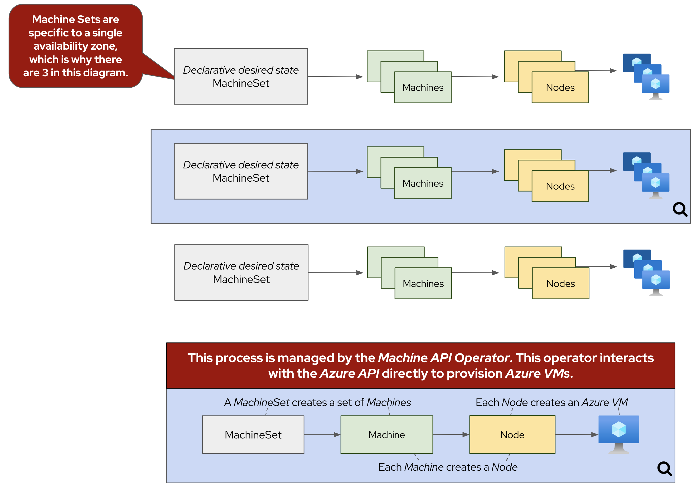

## Introduction

When deploying your ARO cluster, you can configure many aspects of your worker nodes, but what happens when you need to change your worker nodes after they've already been created? These activities include scaling the number of nodes, changing the instance type, adding labels or taints, just to name a few.

Many of these changes are done using MachineSets. MachineSets ensure that a specified number of Machine replicas are running at any given time. Think of a MachineSet as a "template" for the kinds of Machines that make up the worker nodes of your cluster. These are similar to other Kubernetes resources, like a ReplicaSet is to Pods. One important caveat, is that MachineSets allow users to manage many Machines as a single entity, but are contained to a specific availability zone. If you'd like to learn more, see the [Red Hat documentation on machine management](https://docs.openshift.com/container-platform/latest/machine_management/index.html){:target="_blank"}.

Here are some of the advantages of using ARO MachineSets to manage the size of your cluster

* Scalability - MachineSets enables horizontal scaling of your cluster. It can easily add or remove worker to handle the changes in workload. This flexibility ensures that your cluster can dynamically scale to meet the needs of your applications
* Infrastructure Diversity - MachineSets allow you to provision worker nodes of different instance type. This enables you you leverage the best kind of instance family for different workloads.
* Integration with Cluster Autoscaler - MachineSets seamlessly integrate with the Cluster Autoscaler feature, which automatically adjusts the number of worker nodes based on the current demand. This integration ensures efficient resource utilization by scaling the cluster up or down as needed, optimizing costs and performance.

{ align=center }

## Scaling worker nodes
### Via the CLI

1. First, let's see what MachineSets already exist in our cluster. To do so, run the following command:

    ```bash
    oc -n openshift-machine-api get machineset
    ```

    By default, ARO clusters have three MachineSets, one for each availability zone. The output will look something like this:

    ```{.text .no-copy}
    NAME                                 DESIRED   CURRENT   READY   AVAILABLE   AGE
    user1-cluster-8kvh4-worker-{{ azure_region }}1   1         1         1       1           4h36m
    user1-cluster-8kvh4-worker-{{ azure_region }}2   1         1         1       1           4h36m
    user1-cluster-8kvh4-worker-{{ azure_region }}3   1         1         1       1           4h36m
    ```

2. Now, let's take a look at the machines that have been created according to the instructions provided by the above MachineSets. To do so, run the following command:

    ```bash
    oc -n openshift-machine-api get machine
    ```

    For this workshop, we've deployed your ARO cluster with six total machines (three workers machines and three control plane machines), one in each availability zone. The output will look something like this:

    ```{.text .no-copy}
    NAME                                       PHASE     TYPE              REGION   ZONE   AGE
    user1-cluster-8kvh4-master-0               Running   Standard_D8s_v3   {{ azure_region }}   1      4h39m
    user1-cluster-8kvh4-master-1               Running   Standard_D8s_v3   {{ azure_region }}   2      4h39m
    user1-cluster-8kvh4-master-2               Running   Standard_D8s_v3   {{ azure_region }}   3      4h39m
    user1-cluster-8kvh4-worker-{{ azure_region }}1-gls9k   Running   Standard_D4s_v3   {{ azure_region }}   1      4h36m
    user1-cluster-8kvh4-worker-{{ azure_region }}2-xmhrw   Running   Standard_D4s_v3   {{ azure_region }}   2      4h36m
    user1-cluster-8kvh4-worker-{{ azure_region }}3-kggpz   Running   Standard_D4s_v3   {{ azure_region }}   3      4h36m
    ```

3. Now that we know that we have three worker nodes, let's pick a MachineSet to scale up using the OpenShift CLI tools. To do so, run the following command:

    ```bash
    MACHINESET=$(oc -n openshift-machine-api get machinesets -o name | head -1)
    echo ${MACHINESET}
    ```

    The output of the command should look something like this:

    ```{.text .no-copy}
    machineset.machine.openshift.io/user1-cluster-8kvh4-worker-{{ azure_region }}1
    ```

4. Now, let's scale up our selected MachineSet from one to two machines. To do so, run the following command:

    ```bash
    oc -n openshift-machine-api scale --replicas=2 ${MACHINESET}
    ```

5. Now that we've scaled the MachineSet to two machines, we can see that the machine is already being created. First, let's quickly check the output of the same command we ran in step 1:

    ```bash
    oc -n openshift-machine-api get machinesets
    ```

    The output should look something like this:

    ```{.text .no-copy}
    NAME                                 DESIRED   CURRENT   READY   AVAILABLE   AGE
    user1-cluster-8kvh4-worker-{{ azure_region }}1   2         2         1       1           4h50m
    user1-cluster-8kvh4-worker-{{ azure_region }}2   1         1         1       1           4h50m
    user1-cluster-8kvh4-worker-{{ azure_region }}3   1         1         1       1           4h50m
    ```

    !!! note
        Note, that the number of *desired* and *current* nodes matches the scale we specified, but only one is *ready* and *available*.

    We can also run the same command we ran in step 2 to see the machine being provisioned:

    ```bash
    oc -n openshift-machine-api get machine
    ```

    The output should look something like this:

    ```{.text .no-copy}
    NAME                                       PHASE         TYPE              REGION   ZONE   AGE
    user1-cluster-8kvh4-master-0               Running       Standard_D8s_v3   {{ azure_region }}   1      4h58m
    user1-cluster-8kvh4-master-1               Running       Standard_D8s_v3   {{ azure_region }}   2      4h58m
    user1-cluster-8kvh4-master-2               Running       Standard_D8s_v3   {{ azure_region }}   3      4h58m
    user1-cluster-8kvh4-worker-{{ azure_region }}1-gls9k   Running       Standard_D4s_v3   {{ azure_region }}   1      4h55m
    user1-cluster-8kvh4-worker-{{ azure_region }}1-zj7dl   Provisioned   Standard_D4s_v3   {{ azure_region }}   1      9s
    user1-cluster-8kvh4-worker-{{ azure_region }}2-xmhrw   Running       Standard_D4s_v3   {{ azure_region }}   2      4h55m
    user1-cluster-8kvh4-worker-{{ azure_region }}3-kggpz   Running       Standard_D4s_v3   {{ azure_region }}   3      4h55m
    ```

### Via the Console

Now let's scale the cluster back down to a total of 3 worker nodes, but this time, from the web console.

1. Return to your tab with the OpenShift Web Console. If you need to reauthenticate, follow the steps in the [Access Your Cluster](../setup/3-access-cluster/) section.

1. Using the menu on the left Select *Compute* -> *MachineSets*.

    { align=center }

1. In the overview you will see the same information about the MachineSets that you saw on the command line. Now, locate the MachineSet which has "2 of 2" machines, and click on the ⋮ icon, then select *Edit machine count*.

    !!! note
        It may take up to 5 minutes for the MachineSet to scale to 2 nodes 
        while the underlying machine provisions and becomes ready.  Until this time, 
        the machine count will read "1 of 2".

    { align=center }
    { align=center }

1. Next, reduce the count from "2" to "1" and click *Save* to save your changes.

    { align=center }

Congratulations! You've successfully scaled your cluster up and back down to three nodes.

### Summary and Next Steps

Here you learned how to:

* Scaling an existing MachineSet up to add more nodes to the cluster
* Scaling your MachineSet down to remove worker nodes from the cluster 
