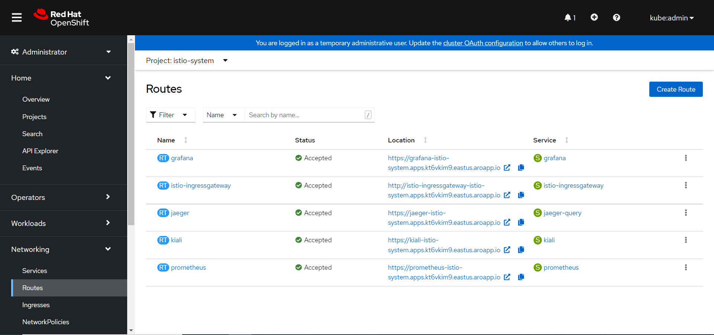
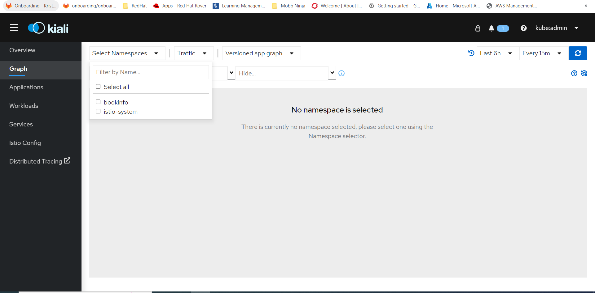
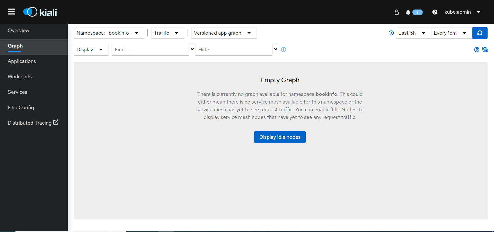
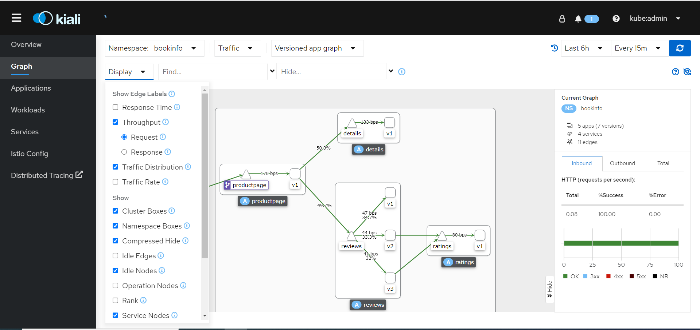

## Kiali Web Console
### Obtain the address for the Kiali web console.

1. **Browse** to the OpenShift Container Platform web console.

1. **Navigate** to project to Networking → Routes.

1. **Click** on the Routes tab, **select** the Service Mesh control plane project, for example `istio-system`, from the Namespace menu.

1. The Location column displays the linked address for each route.

1. **Click** the link in the Location column for Kiali.

1. **Click Login With OpenShift**. The Kiali Overview screen presents tiles for each project namespace.

1. Kiali Console.

1. In Kiali, **click Graph.**

1. **Select** bookinfo from the Namespace list, and App graph from the Graph Type list.

1. **Click** Display idle nodes.

1. **View** Graph and change display settings to add or remove information from the graph.

1. **Click Workload tab**

1. **Select Details Workload**

