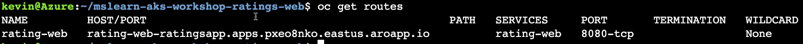
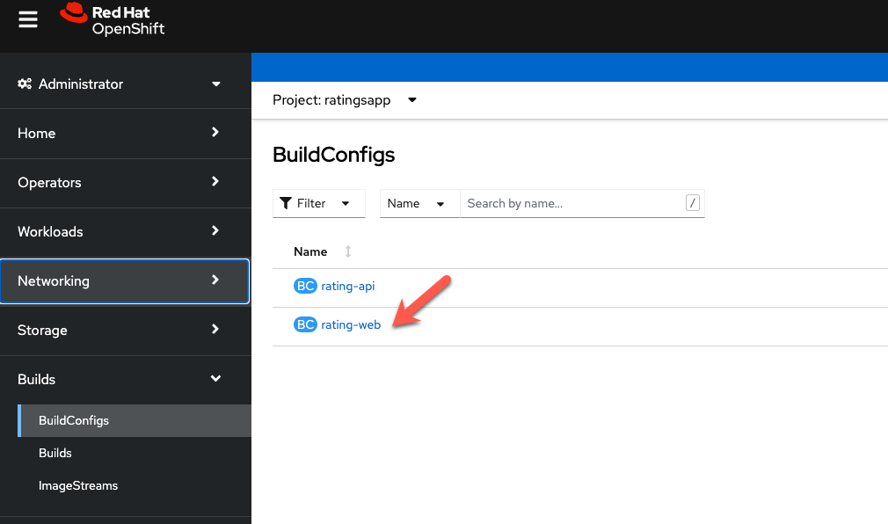
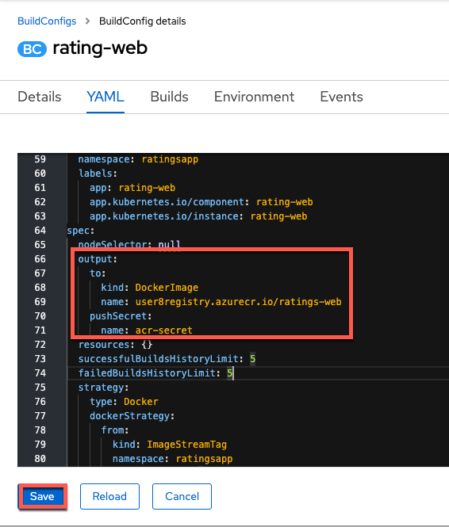
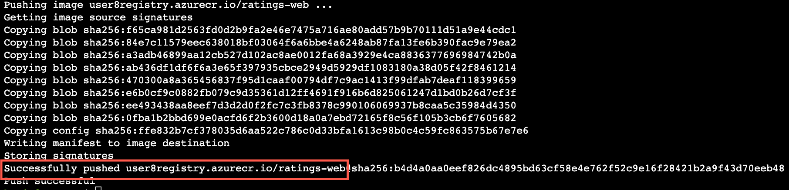
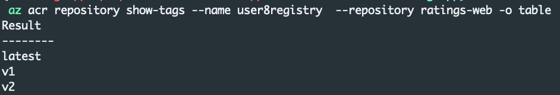

# Install the Frontend 

To install the frontend part of the application, we will be manually building the container image, storing the image in Azure Container Registry and then use manifests to install the frontend.  Later on in the workshop, we will be making changes to the source code so the first step you will need to do is fork the code repository.

Open the following GitHub repository and Fork it to your local Git Hub account.
https://github.com/rh-mobb/aro-workshop-ratings-web

### Setup git

```bash
git config --global user.email "<your github email>"
git config --global user.name “<your github username>”
git init
```

### Clone the Git Repo
From the Azure Cloud Shell, clone the git repo.
```bash
git clone https://github.com/<YOUR GIT NAME>/aro-workshop-ratings-web
```

### Deploy the application
```bash
oc new-app --name rating-web https://github.com/<YOUR GIT NAME/aro-workshop-ratings-web
```

Set the API endpoint environment variable
```bash
oc set env deploy/rating-web API=http://rating-api.ratingsapp.svc.cluster.local:3000
```

Expose the application

```bash
oc expose svc rating-web
```

Get the application url

```bash
oc get routes
```

Open the hostname retrieved above in your web browser with http://<hostname> ... not HTTP and not HTTPS



Now that we have a working app, we are going to update the build to push the image to your Azure Container Registry.

Start by getting the password for your Azure Container Registry Instance:

```bash
az acr update -n $REGISTRY_NAME --admin-enabled true
ACRPWD=$(az acr credential show -n $REGISTRY_NAME --query 'passwords[0].value' -o tsv)
```

Create a secret for ACR and link it.

```bash
oc create secret docker-registry \
    --docker-server=$REGISTRY_NAME.azurecr.io \
    --docker-username=$REGISTRY_NAME \
    --docker-password=$ACRPWD \
    --docker-email=unused \
    acr-secret -n ratingsapp

oc secrets link default acr-secret --for=pull,mount
oc secrets link builder acr-secret --for=pull,mount
```

### Update the BuildConfig to user Azure Container Registry
From the OpenShift Console, click on Builds, BuildConfigs and then the rating-web build config



Click on YAML and then scroll down to the output section and change it so it loosk like this and click save.
!!! info

    Make sure to change the acr registry URL to match the one you created.  ACR does not allow '-' in the name so the name of your registry starts with your userid without the '-' followed by registry.  The example below is for the user-8 userid.

```bash
output:
  to:
    kind: DockerImage
    name: <YOUR USER ID>registry.azurecr.io/ratings-web
  pushSecret:
    name: acr-secret
```


Rebuild the application so that is now pushes the image to the Azure Container Registry.

```bash
oc start-build rating-web
```

View the logs of the build.  Start by find the build pod name:

```bash
oc get pods
```

look for the name of the builder pod that is running and get the logs of that pod

```bash
oc logs rating-web-2-build -f
```

The build process takes a few minutes, wait until the process finishes and you see that the image was succesfully push to ACR.


Finally, you can check with ACR directly to see the repository and images that you have pushed for the frontend.

From the Azure Cloud Shell, run:
```bash
az acr repository show-tags --name user8registry  --repository ratings-web -o table
```

Expected Output:
