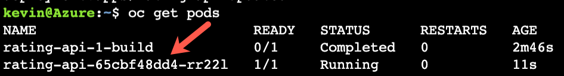
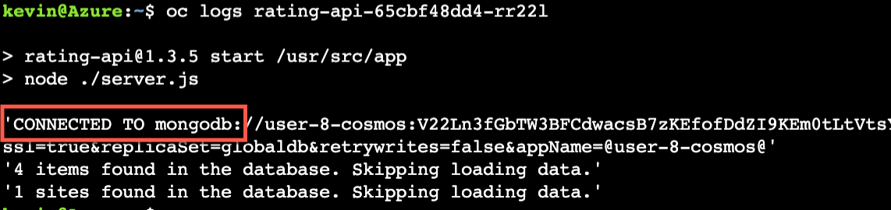

# Deploy the backend Application

We will start by deploying a backend application that will connect to the Cosmos Database that we just created.

### Create a new project 
Start by creating a new project that will contain both our frontend and backend microservices for the applications

```bash
oc new-project ratingsapp
```

### Create the backend part of the application.
We will be using the source to image process to create the backend where all we will need to do is point to the github repository that contains the code for the backend.  OpenShift will take care of the rest and will build and deploy the backend.

```bash
oc new-app --name rating-api https://github.com/rh-mobb/aro-workshop-ratings-api
```

Next, we need to set a couple environment variables to connect the back to our database:

```bash
cosmosKey=$(az cosmosdb keys list -n $COSMOSDB_NAME -g $USERID --query "primaryMasterKey" -o tsv)

COSMOSDB_URI_CONNECTIONSTRING="mongodb://$COSMOSDB_NAME:$cosmosKey@$COSMOSDB_NAME.mongo.cosmos.azure.com:10255/ratingsdb?ssl=true&replicaSet=globaldb&retrywrites=false&appName=@$COSMOSDB_NAME@"

oc set env deploy/rating-api MONGODB_URI=$COSMOSDB_URI_CONNECTIONSTRING
```

### Check the Pods
* note it will take about 3 minutes for the application pods to be created.
```bash
oc get pods
```

expected output:


### Make sure the database is connected
Using the name of the pod above, check the pod logs and look for a log entry that shows the database is connected.


