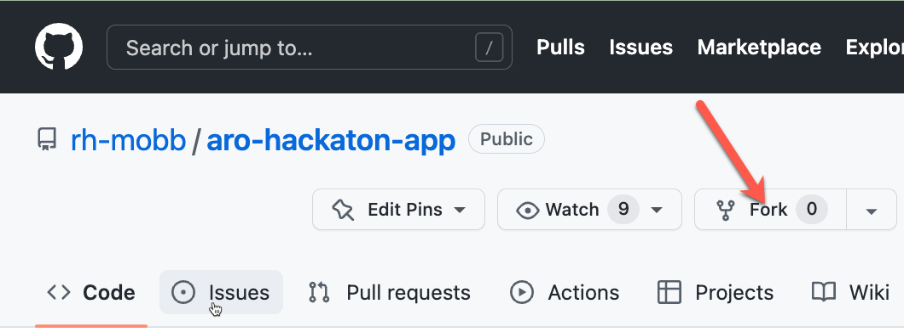
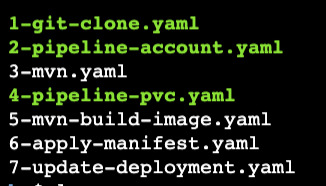
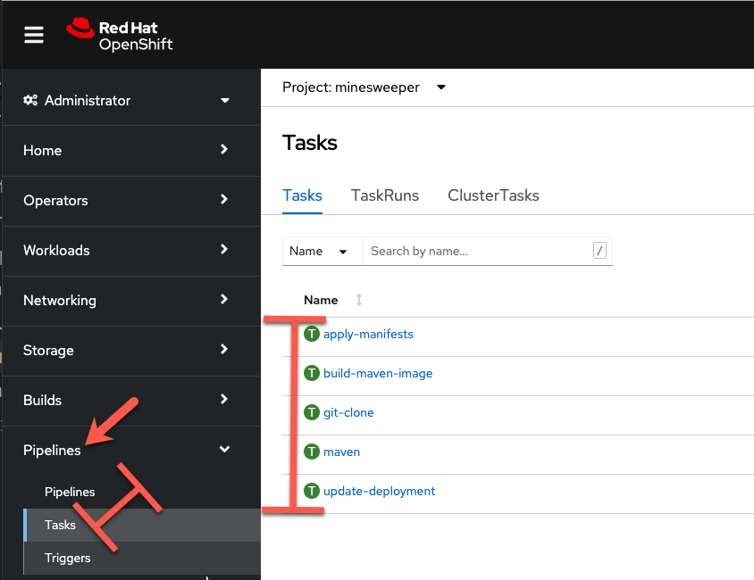
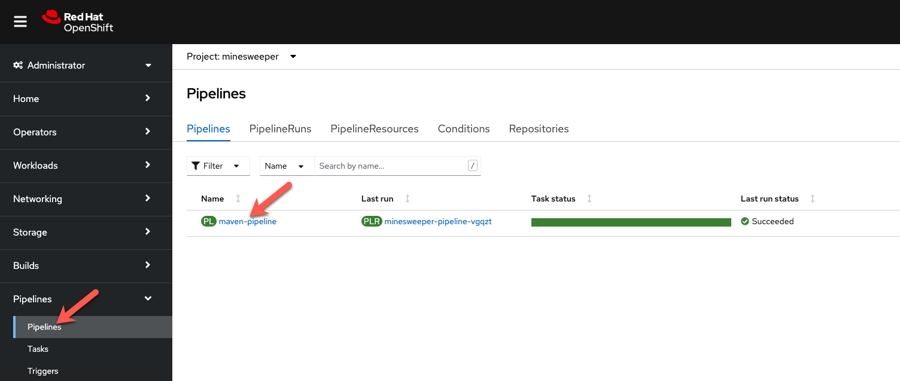
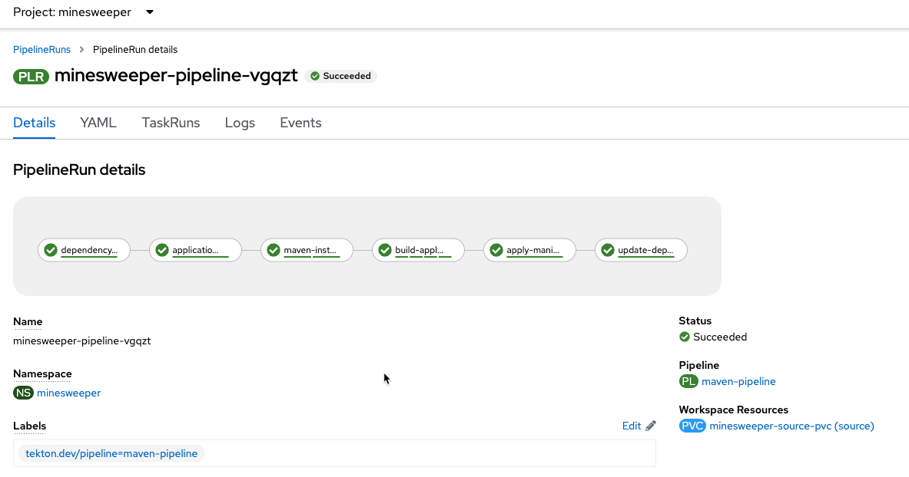

# Deploy and Expose an Application
Securing exposing an Internet facing application with an ARO Cluster.

When you create a cluster on ARO you have several options in making the cluster public or private. With a public cluster you are allowing Internet traffic to the api and *.apps endpoints. With a private cluster you can make either or both the api and .apps endpoints private.

How can you allow Internet access to an application running on your private cluster where the .apps endpoint is private? This document will guide you through using Azure Frontdoor to expose your applications to the Internet. There are several advantages of this approach, namely your cluster and all the resources in your Azure account can remain private, providing you an extra layer of security. Azure FrontDoor operates at the edge so we are controlling traffic before it even gets into your Azure account. On top of that, Azure FrontDoor also offers WAF and DDoS protection, certificate management and SSL Offloading just to name a few benefits.

*Note: in this workshop we are using public clusters to simplify connectity to the environment.  Even though we are using a public cluster, the same methodology applies to expose an application to the Internet from a private cluster.

## Prerequisites
* a unique USER ID
* Azure Database for PostgreSQL
* Azure Container Registry Instance and Password
* A public GitHub id ( only required for the Pipeline Part )
<br>

## Deploy an application
Now the fun part, let's deploy an application!  
We will be deploying a Java based application called [microsweeper](https://github.com/redhat-mw-demos/microsweeper-quarkus/tree/ARO).  This is an application that runs on OpenShift and uses a PostgreSQL database to store scores.  With ARO being a first class service on Azure, we will create an Azure Database for PostgreSQL service and connect it to our cluster with a private endpoint.

Prerequisites - this part of the workshop assumes you have already created a Azure Database for PostgreSQL database named <USERID>-microsweeper-database that you created and configured in a previous step.

1. Throughout this tutorial, we will be distinguishing your application and resources based on a USERID assigned to you.  Please see a facilitator if they have not given you a USER ID.

From the Azure Cloud Shell, set an environment variable for your user id and the Azure Resource Group given to you by the facilitor:

```bash
export USERID=<The user ID a facilitator gave you>
export ARORG=<The Azure Resource Group a facilitator gave you>

```

1. The first thing we need to do is get a copy of the code that we will build and deploy to our clusters.  Clone the git repository

   ```bash
   git clone -b ARO https://github.com/rh-mobb/aro-hackaton-app
   ```

1. change to the root directory

   ```bash
   cd aro-hackaton-app
   ```


1. Log into your openshift cluster with Azure Cloud Shell

1. Switch to your OpenShift Project

   ```bash
   oc project <USER ID>
   ```

1. add the openshift extension to quarkus

   ```bash
   quarkus ext add openshift
   ```

1. Edit aro-hackaton-app/src/main/resources/application.properties

   Make sure your file looks like the one below, changing the IP address on line 3 to the private ip address of your postgres instance.  You should have gotten your PostgreSQL private IP in the previous step when you created the database instance.

   Also change the following line to represent the database that has been configured for you:
   **%prod.quarkus.datasource.username=quarkus@/<USERID/>-microsweeper-database**
 
   Also note the options in OpenShift Configurations.

   **%prod.quarkus.openshift.deployment-kind=Deployment**
   We will be creating a deployment for the application. 

   **%prod.quarkus.openshift.build-strategy=docker**
   The application will be built uisng Docker.

   **%prod.quarkus.container-image.group=minesweeper**
   The application will use minesweeper project that we previously created.

   **%prod.quarkus.openshift.expose=true**
   We will expose the route using the default openshift router domain - apps./<cluster-id/>.eastus.aroapp.io


   Sample microsweeper-quarkus/src/main/resources/application.properties

   ```
   # Database configurations
   %prod.quarkus.datasource.db-kind=postgresql
   %prod.quarkus.datasource.jdbc.url=jdbc:postgresql://<CHANGE TO PRIVATE IP>:5432/score
   %prod.quarkus.datasource.jdbc.driver=org.postgresql.Driver
   %prod.quarkus.datasource.username=quarkus@<USERID>microsweeper-database
   %prod.quarkus.datasource.password=r3dh4t1!
   %prod.quarkus.hibernate-orm.database.generation=drop-and-create
   %prod.quarkus.hibernate-orm.database.generation=update

   # OpenShift configurations
   %prod.quarkus.kubernetes-client.trust-certs=true
   %prod.quarkus.kubernetes.deploy=true
   %prod.quarkus.kubernetes.deployment-target=openshift
   #%prod.quarkus.kubernetes.deployment-target=knative
   %prod.quarkus.openshift.build-strategy=docker
   %prod.quarkus.openshift.expose=true
   %prod.quarkus.openshift.deployment-kind=Deployment
   %prod.quarkus.container-image.group=minesweeper

   # Serverless configurations
   #%prod.quarkus.container-image.group=microsweeper-%prod.quarkus
   #%prod.quarkus.container-image.registry=image-registry.openshift-image-registry.svc:5000

   # macOS configurations
   #%prod.quarkus.native.container-build=true
   ```

1. Build and deploy the quarkus application to OpenShift.  One of the great things about OpenShift is the concept of Source to Image, where you simply point to your source code and OpenShift will build and deploy your application.  

In this first example, we will be using source to image and build configs that come built in with Quarkus and OpenShift.  To start the build ( and deploy ) process simply run the following command.

   ```bash
   quarkus build --no-tests
   ```

Let's take a look at what this did along with everything that was created in your cluster.

### Container Images

Log into the OpenShift Console and from the Administrator perspective, expand Builds and then Image Streams, and select the minesweeper Project.

You will see two images that were created on your behalf when you ran the quarkus build command.  There is one for openjdk-11 that comes with OpenShift as a Universal Base Image (UBI) that the application will run under. With UBI, you get highly optimized and secure container images that you can build your applications with.   For more information on UBI please read this [article](https://www.redhat.com/en/blog/introducing-red-hat-universal-base-image)

The second image you see is the the microsweeper-appservice image.  This is the image for the application that was build automatically for you and pushed to the container registry that comes with OpenShift.

### Image Build

How did those images get built you ask?   Back on the OpenShift Console, *Click* on Build Configs and then the microsweeper-appservice entry.

When you ran the quarkus build command, this created the build config you can see here.  In our quarkus settings, we set the deployment strategy to build the image using Docker.  The Dockerfile file from the git repo that we cloned ~/microsweeper-quarkus/Dockerfile was used for this Build Config.  

```
A build configuration describes a single build definition and a set of triggers for when a new build is created. Build configurations are defined by a BuildConfig, which is a REST object that can be used in a POST to the API server to create a new instance.
```
You can read more about BuildConfigs [here](https://docs.openshift.com/container-platform/4.11/cicd/builds/understanding-buildconfigs.html)

Once the BuildConfig was created, the source to image process kicked off a Build of that build config.  The build is what actually does the work in building and deploying the image.  So we started with defining what to be built with the BuildConfig and then actuall did the work with the Build.
You can read more about Builds [here](https://docs.openshift.com/container-platform/4.11/cicd/builds/understanding-image-builds.html)

To look at what the build actually did, click on Builds tab and then into the first Build in the list.


On the next screen, explore around and look at the YAML definition of the build, Logs to see what the build actually did.  If you build failed for some reason, logs is a great first place to start to look at to debug what happened.


### Image Deployment
After the image was built, the S2I process then deployed the application for us.  In the quarkus properties file, we specified that a deployment should be created.  You can view the deployment under Workloads, Deployments, and then click on the Deployment name.


Explore around the deployment screen, check out the different tabs, look at the YAML that was created.


Look at the pod the deployment created, and see that it is running.


The last thing we will look at is the Route that was created for our application.  In the quarkus properties file, we specified that the application should be exposed to the Internet.  When you create a Route, you have the option to specify a hostname.  To start with, we will just use the default domain that comes with ARO.  In next section, we will expose the same appplication to a custom domain leverage Azure Front Door.

You can read more about Routes [here](https://docs.openshift.com/container-platform/4.11/networking/routes/route-configuration.html)

From the OpenShift menu, click on Networking, Routes, and the microsweeper-appservice route.


## Test the application
While in the Route section of the OpenShift UI, click the url under location:


You can also get the the url for your application using the command line:
```bash
oc get routes -o json | jq -r '.items[0].spec.host'
```

Point your broswer to the application!!


### Application IP 
Let's take a quick look at what IP the application resolves to.  Back in your Cloud Shell environment, run
```bash
nslookup <route host name>

i.e. nslookup microsweeper-appservice-minesweeper.apps.fiehcjr1.eastus.aroapp.io
```
Note: you can get the host name with:
```bash
oc get routes -o json | jq -r '.items[0].spec.host'
```
You should see results like the following:


Notice the IP address - can you guess where it comes from?

It comes from the ARO Load Balancer.  In this workshop, we are using a Public Cluster which means the load balancer is exposed to the Internet.  If this was a private cluster, you would have to have connectivity to the VNET ARO is running on whether that be VPN, Express Route, or something else.

To view the ARO load balancer, on the Azure Portal, Search for 'Load Balancers' and click on the Load balancers service.


Scroll down the list of load balancers until you see the one with your cluster name.  You will notice two load balancers, one that has -internal in the name and one that does not.  The '*-internal' load balancer is used for the OpenShift API.  The other load balancer ( without -internal ) in the name is used for applications.  Click into the load balancer for applications.


On the next screen, click on Frontend IP configuration.  Notice the IP address of the 2nd load balancer on the list.  This IP address matches what you found with the nslookup command.


For the fun of it, we can also look at what backends this load balancer is connected to. Click into the 2nd load balancer on the list above, and then click into the first rule.


On the next screen, notice the Backend pool.  This is the subnet that contains all the workers.  And the best part is all of this came with OpenShift and ARO!


## Expose the application with Front Door
Up to this point, we have deployed the minesweeper app using the publically available Ingress Controller that comes with OpenShift.  Best practices for ARO clusters is to make them private ( both the api server and the ingress controller) and then exposing the application you need with something like Azure Front Door.

In the following section of the workshop, we will go through setting up Azure Front Door and then exposing our minesweeper application with Azure Front Door using a custom domain.

The following diagram shows what we will configure.


There are several advantages of this approach, namely your cluster and all the resources in your Azure account can remain private, providing you an extra layer of security. Azure FrontDoor operates at the edge so we are controlling traffic before it even gets into your Azure account. On top of that, Azure FrontDoor also offers WAF and DDoS protection, certificate management and SSL Offloading just to name a few benefits.

As you can see in the diagram, Azure Front Door sits on the edge of the Microsoft network and is connected to the cluster via a private link service.  With a private cluster, this means all traffic goes through Front Door and is secured at the edge.  Front Door is then connected to your cluster through a private connection over the Microsoft backbone.

Setting up and configuring Azure Front Door for the minesweeper application is typically something the operations team would do.  If you are interested in going through the steps, you can do so here.  Or simply run this [script]/scripts/frontdoor-install-config.sh <ARO Resource Group> <ARO Cluster Name> <Your User ID>

## Detailed steps and instructions.

* note - the steps below must be executed from a system with connectivity to the cluster such as the Azure Cloud Shell.

The first step is to export three environment variables for the Resource Group ARO is in, the ARO Cluster name, and your User ID.

```bash
export ARORG=(ARO Resource Group Name)
export AROCLUSTER=(ARO Cluster Name)
export USER=(Your User ID)
```

Next we, need to get the name of the VNET ARO is in

```bash
VNET_NAME=$(az network vnet list -g $ARORG --query '[0].name' -o tsv)
```

Provide a subnet prefix for the private link subnet.  This subnet will contain the private link service we will use to connect Front Door with ARO.

```bash
PRIVATEENDPOINTSUBNET_PREFIX=10.1.5.0/24
```

Give the private link subnet a meaningful name

```bash
PRIVATEENDPOINTSUBNET_NAME='PrivateEndpoint-subnet'
```

Create a unique random number so we don't create services with the same name

```bash
UNIQUE=$RANDOM
```

Provide a unique name for the Azure Front Door Service we will create

```bash
AFD_NAME=$UNIQUE-afd
```

Get the ARO Cluster Resource Group name.  Note this the name of the resource group that the ARO service creates and manages.  This is the resource group that contains all the VMs, Storage, Load Balancers, etc that ARO manages.

```bash
ARO_RGNAME=$(az aro show -n $AROCLUSTER -g $ARORG --query "clusterProfile.resourceGroupId" -o tsv | sed 's/.*\///')
```

Get the Azure location of the ARO cluster

```bash
LOCATION=$(az aro show --name $AROCLUSTER --resource-group $ARORG --query location -o tsv)
```

Get the workers nodes subnet name and IDs so we can connect the Azure Front Door to the workers nodes using a private link service.
```bash
WORKER_SUBNET_NAME=$(az aro show --name $AROCLUSTER --resource-group $ARORG --query 'workerProfiles[0].subnetId' -o tsv | sed 's/.*\///')
WORKER_SUBNET_ID=$(az aro show --name $AROCLUSTER --resource-group $ARORG --query 'workerProfiles[0].subnetId' -o tsv)
# privatelink_id=$(az network private-link-service show -n $AROCLUSTER-pls -g $ARORG --query 'id' -o tsv)
```

Get the internal load balancer name, id and ip that the private link service will be connected to.

```bash
INTERNAL_LBNAME=$(az network lb list --resource-group $ARO_RGNAME --query "[? contains(name, 'internal')].name" -o tsv)
LBCONFIG_ID=$(az network lb frontend-ip list -g $ARO_RGNAME --lb-name $INTERNAL_LBNAME --query "[? contains(subnet.id,'$WORKER_SUBNET_ID')].id" -o tsv)
LBCONFIG_IP=$(az network lb frontend-ip list -g $ARO_RGNAME --lb-name $INTERNAL_LBNAME --query "[? contains(subnet.id,'$WORKER_SUBNET_ID')].privateIpAddress" -o tsv)
```

Set the following DNS variables for the workshop so we can add DNS records to the azure.mobb.ninja domain

```bash
DNS_RG=mobb-dns
TOP_DOMAIN=azure.mobb.ninja
```

Set user specific domain settings.  We will be creating a new DNS zone with the DOMAIN variable.
ARO_APP_FQDN is the fully qualified url for your minesweeper application
ARO_MINE_CUSTOM_DOMAIN_NAME is the name of the DNS entry.

```bash
DOMAIN=$USER.azure.mobb.ninja
ARO_APP_FQDN=minesweeper.$USER.azure.mobb.ninja
AFD_MINE_CUSTOM_DOMAIN_NAME=minesweeper-$USER-azure-mobb-ninja
```

Now that we have all the required variables set, we can start creating the Front Door service and everything it needs.

#### Create a private link service targeting the worker subnets

The first thing we will create is the private link service, that again is what will provide private connectivty from Front Door to your cluster.

```bash
az network private-link-service create \
--name $AROCLUSTER-pls \
--resource-group $ARORG \
--private-ip-address-version IPv4 \
--private-ip-allocation-method Dynamic \
--vnet-name $VNET_NAME \
--subnet $WORKER_SUBNET_NAME \
--lb-frontend-ip-configs $LBCONFIG_ID
```

Create an instance of Azure Front Door and get the Front Door ID.

```bash
az afd profile create \
--resource-group $ARORG \
--profile-name $AFD_NAME \
--sku Premium_AzureFrontDoor

afd_id=$(az afd profile show -g $ARORG --profile-name $AFD_NAME --query 'id' -o tsv)
```

Create a Front Door endpoint for the ARO Internal Load Balancer.  This will allow Front Door to send traffic to the ARO Load Balancer.

```bash
az afd endpoint create \
--resource-group $ARORG \
--enabled-state Enabled \
--endpoint-name 'aro-ilb'$UNIQUEID \
--profile-name $AFD_NAME
```

Create a Front Door Origin Group that will point to the ARO Internal Loadbalancer
```bash
az afd origin-group create \
--origin-group-name 'afdorigin' \
--probe-path '/' \
--probe-protocol Http \
--probe-request-type GET \
--probe-interval-in-seconds 100 \
--profile-name $AFD_NAME \
--resource-group $ARORG \
--probe-interval-in-seconds 120 \
--sample-size 4 \
--successful-samples-required 3 \
--additional-latency-in-milliseconds 50
```

Create a Front Door Origin with the above Origin Group that will point to the ARO Internal Loadbalancer.
Click [here](https://docs.microsoft.com/en-us/azure/frontdoor/origin?pivots=front-door-standard-premium) to read more about Front Door Origins and Origin Groups.

```bash
az afd origin create \
--enable-private-link true \
--private-link-resource $privatelink_id \
--private-link-location $LOCATION \
--private-link-request-message 'Private link service from AFD' \
--weight 1000 \
--priority 1 \
--http-port 80 \
--https-port 443 \
--origin-group-name 'afdorigin' \
--enabled-state Enabled \
--host-name $LBCONFIG_IP \
--origin-name 'afdorigin' \
--profile-name $AFD_NAME \
--resource-group $ARORG
```

Approve the private link connection

```bash
privatelink_pe_id=$(az network private-link-service show -n $AROCLUSTER-pls -g $ARORG --query 'privateEndpointConnections[0].id' -o tsv)

az network private-endpoint-connection approve \
--description 'Approved' \
--id $privatelink_pe_id
```

Add your custom domain to Azure Front Door

```bash
az afd custom-domain create \
--certificate-type ManagedCertificate \
--custom-domain-name $AFD_MINE_CUSTOM_DOMAIN_NAME \
--host-name $ARO_APP_FQDN \
--minimum-tls-version TLS12 \
--profile-name $AFD_NAME \
--resource-group $ARORG
```

Create an Azure Front Door endpoint for your custom domain

```bash
az afd endpoint create \
--resource-group $ARORG \
--enabled-state Enabled \
--endpoint-name 'aro-mine-'$UNIQUEID \
--profile-name $AFD_NAME
```

Add an Azure Front Door route for your custom domain

```bash
az afd route create \
--endpoint-name 'aro-mine-'$UNIQUEID \
--forwarding-protocol HttpOnly \
--https-redirect Disabled \
--origin-group 'afdorigin' \
--profile-name $AFD_NAME \
--resource-group $ARORG \
--route-name 'aro-mine-route' \
--supported-protocols Http Https \
--patterns-to-match '/*' \
--custom-domains $AFD_MINE_CUSTOM_DOMAIN_NAME
```

#### Update DNS
Now that we have Front Door setup and configured, we need to setup DNS to work with the front door endpoint.

Get a validation token from Front Door so Front Door can validate your domain

```bash
afdToken=$(az afd custom-domain show \
--resource-group $ARORG \
--profile-name $AFD_NAME \
--custom-domain-name $AFD_MINE_CUSTOM_DOMAIN_NAME \
--query "validationProperties.validationToken")
```

Create a dns zone for your minesweeper application

```bash
az network dns zone create --name $DOMAIN --resource-group $DNS_RG --parent-name $TOP_DOMAIN
```

Update Azure nameservers to match the top level domain with the new workshop user domain

```bash
for i in $(az network dns zone show -g $DNS_RG -n $TOP_DOMAIN --query "nameServers" -o tsv)
do
az network dns record-set ns add-record -g $DNS_RG -z $DOMAIN -d $i -n @
done
```

Create a new text record in your DNS server

```bash
az network dns record-set txt add-record -g $DNS_RG -z $DOMAIN -n _dnsauth.$(echo $ARO_APP_FQDN | sed 's/\..*//') --value $afdToken --record-set-name _dnsauth.$(echo $ARO_APP_FQDN | sed 's/\..*//')
```

Check if the domain has been validated:
*Note this would be a great time to take a break and grab a coffee ... it can take several minutes for Azure Front Door to validate your domain.

```
az afd custom-domain list -g $ARORG --profile-name $AFD_NAME --query "[? contains(hostName, '$ARO_APP_FQDN')].domainValidationState"
```

Get the Azure Front Door endpoint:

```bash
afdEndpoint=$(az afd endpoint show -g $ARORG --profile-name $AFD_NAME --endpoint-name aro-mine-$UNIQUEID --query "hostName" -o tsv)
```

Create a cname record for the application

```bash
az network dns record-set cname set-record -g $DNS_RG -z $DOMAIN \
 -n $(echo $ARO_APP_FQDN | sed 's/\..*//') -z $DOMAIN -c $afdEndpoint
```

### Congratations!!
If you made it this far and setup Front Door yourself, pat yourself on the back.

## Configure the application to use Front Door
Now that front door has been configured and we have a custom domain pointing to our application, we can now configure the application to use Azure Front Door and your custom domain.

The first thing we need to do is delete the route that is connecting directly to our cluster.

```bash
oc delete route microsweeper-appservice
```

Next, we create a new route that points to our application.

Create new route

```bash
cat << EOF | oc apply -f -
apiVersion: route.openshift.io/v1
kind: Route
metadata:
  labels:
    app.kubernetes.io/name: microsweeper-appservice
    app.kubernetes.io/version: 1.0.0-SNAPSHOT
    app.openshift.io/runtime: quarkus
  name: microsweeper-appservice
  namespace: minesweeper
spec:
  host: $ARO_APP_FQDN
  to:
    kind: Service
    name: microsweeper-appservice
    weight: 100
    targetPort:
      port: 8080
  wildcardPolicy: None
EOF
```

# TODO - screen shots to show nslookup points to the edge

# Automate deploying the application with OpenShift Pipelines

We will be using OpenShift Pipelines which is based on the Open Source Tekton project to automatically deploy our application using a CI/CD pipeline.
 
If you would like to read more about OpenShift Pipelines, click [here](https://docs.openshift.com/container-platform/4.11/cicd/pipelines/understanding-openshift-pipelines.html)

The first thing you need to do is fork the code repositories so that you can make changes to the code base and then OpenShift pipelines will build and deploy the new code.

Opening your browser, go to the following github repos 
https://github.com/rh-mobb/common-java-dependencies
https://github.com/rh-mobb/aro-hackaton-app

For each of the repositories, click Fork and then choose your own Git Account.


The next thing we need to do is import common Tekton tasks that our pipeline will use.  These common tasks are designed to be reused across multiple pipelines.

Let's start by taking a look at the reusable Tasks that we will be using.  From your cloud shell, change directorys to ~/aro-hackaton-app/pipeline and list the files.

```bash
cd ~/aro-hackaton-app/pipeline/tasks
ls
```
Expected output:


1-git-clone.yaml
Clones a given GitHub Repo.

2-mvn.yaml
This Task can be used to run a Maven build

3-mvn-build-image.yaml
Packages source with maven builds and into a container image, then pushes it to a container registry. Builds source into a container image using Project Atomic's Buildah build tool. It uses Buildah's support for building from Dockerfiles, using its buildah bud command.This command executes the directives in the Dockerfile to assemble a container image, then pushes that image to a container registry.

4-apply-manifest.yaml
Applied manifest files to the cluster

5-update-deployment.yaml
Updates a deployment with the new container image.

From the Cloud Shell, we need to apply all of these tasks to our cluster.  Run the following command:
oc apply -f ~/aro-hackaton-app/pipeline/tasks

expected output:


Next, we need to create a secret to push and pull images into Azure Container Registry.  Each attendee has their own Azure Container Registry service assigned to them, with the naming convention <USERID>acr.azurecr.io

```bash
ACRPWD=$(az acr credential show -n ${USERID}acr -g $ARORG --query 'passwords[0].value' -o tsv)

oc create secret docker-registry --docker-server=${USERID}acr.azurecr.io --docker-username=${USERID}acr --docker-password=$ACRPWD --docker-email=unused acr-secret
```

Create the pipeline service account and permissions that the pipeline tasks will run under:

```bash
oc create -f ~/aro-hackaton-app/pipeline/1-pipeline-account.yaml
```

Expected output:


Link the acr-secret you just created to it can mount and pull images

```bash
oc secrets link pipeline acr-secret --for=pull,mount
```

Make sure the secret is linked to the pipeline service account.

```bash
oc describe sa pipeline
```

expected output: 


We also need to give the pipeline permission for certain security context constraints to that it can execute.

```bash
oc adm policy add-scc-to-user anyuid -z pipeline
oc adm policy add-scc-to-user privileged -z pipeline
```

Create a PVC that the pipeline will use to storage the build images:

```bash
oc create -f ~/aro-hackaton-app/pipeline/2-pipeline-pvc.yaml
```

Next we need to create the pipeline definition.  Before we actually create the pipeline, lets take a look at the pipeline definition.

Open a browser to the git repo to browse the pipeline.yaml file.
https://github.com/rh-mobb/aro-hackaton-app/blob/main/pipeline/3-pipeline.yaml

Browse through the file and notice all the tasks that are being executed.  These are the tasks we imported in the previous step.  The pipeline definition simply says which order the tasks are run and what parameters should be passed between tasks.


Now that we have the source code forked, we need to copy the properties file we created earlier to our new code base.  Let's create a new directory, clone the repo and copy the file.

Using the cloud shell, run the following commands.
```bash
mkdir ~/$USER
cd $USER
cp ../aro-hackaton-app/src/main/resources/application.properties aro-hackaton-app/src/main/resources/application.properties 
```

Setup git and push changes to the properties file

```bash
git config --global user.email "kmcolli@gmail.com"
git config --global user.name “kmcolli”
git init

git add *
git commit -am "Update Propereties File"
git push
```
* when prompted log in with your git user name ( email ) and git token.  If you need a git token, please refer to this [document](https://catalyst.zoho.com/help/tutorials/githubbot/generate-access-token.html)


Now create the pipeline definition on your cluster:

```bash
oc create -f ~/aro-hackaton-app/pipeline/3-pipeline.yaml
``` 

and Finally we will create a pipeline run that will execute the pipeline, which will pull code from the your git repo that you forked, will build the image and deploy it to OpenShift.

There are a couple settings in the pipeline run that we will need to update.

Edit the ~/aro-hackaton-app/pipeline/4-pipeline-run.yaml file.  The three things to change is the:
* dependency-git-url - to point to your personal git repository
* application-git-url - to point to your personal git repository
* image-name - change this to reflect to the ACR Registry created for you ... this should be $USERID.azurecr.io/minesweeper


After editing the file, now create the pipeline run.

```bash
oc create -f ~/aro-hackaton-app/pipeline/4-pipeline-run.yaml
```

This will start a pipeline run and redeploy the minesweeper application, but this time will build the code from your github repository and the pipeline will deploy the application as well to OpenShift.

Let's take a look at the OpenShift console to see what was created and if the application was successfully deployed.

From the OpenShift Conole - Administrator view, click on Pipelines and then Tasks.


Notice the 5 tasks that we imported and click into them to view the yaml defitions.

Next, lets look at the Pipeline.   Click on Pipelines.  Notice that that last run was successful.  Click on maven-pipeline to view the pipeline details.


On the following screen, click on Pipeline Runs to view the status of each Pipeline Run.


Lastely, click on the piperun name and you can see all the details and steps of the Pipeline.  If your are curious, also click on logs and view the logs of the different tasks that were ran.


So now we can successfully build and deploy new code by manually runnning a pipeline run.  But how can we configure the pipeline to run automatically when we commit code with GIT?  We can do so with Triggers!


