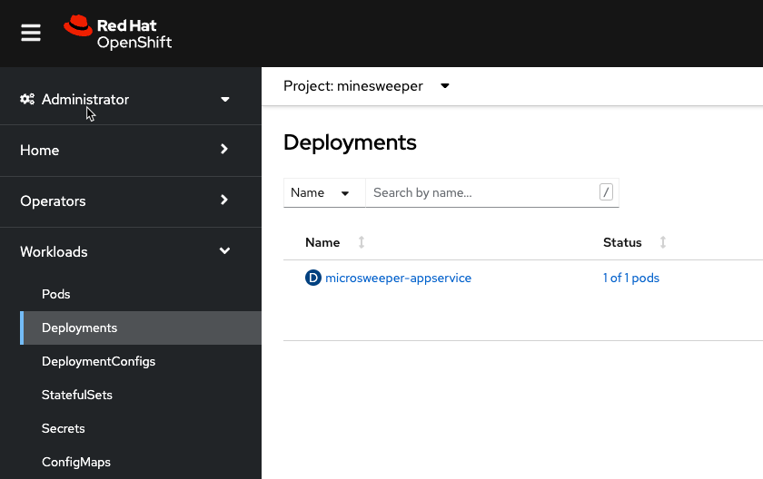
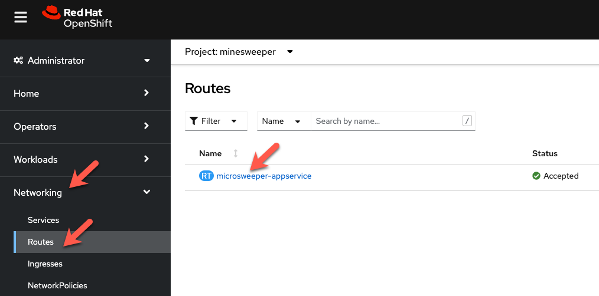

# Deploy and Expose an Application
Securing exposing an Internet facing application with an ARO Cluster.

When you create a cluster on ARO you have several options in making the cluster public or private. With a public cluster you are allowing Internet traffic to the api and *.apps endpoints. With a private cluster you can make either or both the api and .apps endpoints private.

How can you allow Internet access to an application running on your private cluster where the .apps endpoint is private? This document will guide you through using Azure Frontdoor to expose your applications to the Internet. There are several advantages of this approach, namely your cluster and all the resources in your Azure account can remain private, providing you an extra layer of security. Azure FrontDoor operates at the edge so we are controlling traffic before it even gets into your Azure account. On top of that, Azure FrontDoor also offers WAF and DDoS protection, certificate management and SSL Offloading just to name a few benefits.

!!! info 

    In this workshop we are using public clusters to simplify connectity to the environment.  Even though we are using a public cluster, the same methodology applies to expose an application to the Internet from a private cluster.  To similate a private cluster, we will be creating a 2nd private Ingress Controller.

## Prerequisites
* a unique USER ID
* Azure Database for PostgreSQL
* Azure Container Registry Instance and Password
* A public GitHub id ( only required for the 'Automate Deploying the App' )
<br>

## Deploy an application
Now the fun part, let's deploy an application!  
We will be deploying a Java based application called [microsweeper](https://github.com/redhat-mw-demos/microsweeper-quarkus/tree/ARO).  This is an application that runs on OpenShift and uses a PostgreSQL database to store scores.  With ARO being a first class service on Azure, we will create an Azure Database for PostgreSQL service and connect it to our cluster with a private endpoint.

Prerequisites - this part of the workshop assumes you have already created a Azure Database for PostgreSQL database named <USERID>-microsweeper-database that you created and configured in a previous step.

!!! info
    
    Throughout this tutorial, we will be distinguishing your application and resources based on a USERID assigned to you.  Please see a facilitator if they have not given you a USER ID.

From the Azure Cloud Shell, set an environment variable for your user id and the Azure Resource Group given to you by the facilitor:

```bash
export USERID=<The user ID a facilitator gave you>
export ARORG=<The Azure Resource Group a facilitator gave you>
export ARO_APP_FQDN=minesweeper.$USERID.azure.mobb.ninja
```

**Clone the git repository** 

  The first thing we need to do is get a copy of the code that we will build and deploy to our clusters.  

   ```bash
   git clone https://github.com/rh-mobb/aro-hackaton-app
   ```

**Change to the root directory**

   ```bash
   cd aro-hackaton-app
   ```


**Log into your openshift cluster with Azure Cloud Shell**

**Switch to your OpenShift Project**

   ```bash
   oc project <USER ID>
   ```
  
!!! info
      
      As part of the workshop setup, an OpenShift project has been created using your USERID as the name of the project

**Add the OpenShift extension to quarkus**

   ```bash
   quarkus ext add openshift
   ```

**Edit aro-hackaton-app/src/main/resources/application.properties**

  Make sure your file looks like the one below, changing the following line:
  
  - **%prod.quarkus.datasource.jdbc.url=jdbc:postgresql://<USERID>-minesweeper-database:5432/score** <br>
    Change the above line with your USERID for the database that has been already been configured for you<br><br>
  - **%prod.quarkus.container-image.group=<CHANGE TO YOUR NAMESPACE>**
    Change the above line with your USERID for the namespace to deploy the application to
  
!!! info
  
    Note the options in OpenShift Configurations.<br>
    - **%prod.quarkus.openshift.deployment-kind=Deployment** <br>
      We will be creating a deployment for the application.<br><br>
    - **%prod.quarkus.openshift.build-strategy=docker** <br>
      The application will be built uisng Docker.<br><br>
    - **%prod.quarkus.container-image.group=minesweeper** <br>
      The application will use the namespace your facilitator assigned to you.<br><br>
    - **%prod.quarkus.openshift.expose=true** <br>
      We will expose the route using the default openshift router domain - apps.\<cluster-id\>.eastus.aroapp.io

   Sample microsweeper-quarkus/src/main/resources/application.properties

   ```
   # Database configurations
   %prod.quarkus.datasource.db-kind=postgresql
   %prod.quarkus.datasource.jdbc.url=jdbc:postgresql://<USERID>-minesweeper-database:5432/score
   %prod.quarkus.datasource.jdbc.driver=org.postgresql.Driver
   %prod.quarkus.datasource.username=quarkus
   %prod.quarkus.datasource.password=r3dh4t1!
   %prod.quarkus.hibernate-orm.database.generation=drop-and-create
   %prod.quarkus.hibernate-orm.database.generation=update

   # OpenShift configurations
   %prod.quarkus.kubernetes-client.trust-certs=true
   %prod.quarkus.kubernetes.deploy=true
   %prod.quarkus.kubernetes.deployment-target=openshift
   #%prod.quarkus.kubernetes.deployment-target=knative
   %prod.quarkus.openshift.build-strategy=docker
   %prod.quarkus.openshift.expose=true
   %prod.quarkus.openshift.deployment-kind=Deployment
   %prod.quarkus.container-image.group=<CHANGE TO YOUR NAMESPACE>

   # Serverless configurations
   #%prod.quarkus.container-image.group=microsweeper-%prod.quarkus
   #%prod.quarkus.container-image.registry=image-registry.openshift-image-registry.svc:5000

   # macOS configurations
   #%prod.quarkus.native.container-build=true
   ```

   


**Build and deploy the quarkus application to OpenShift.**

One of the great things about OpenShift is the concept of Source to Image, where you simply point to your source code and OpenShift will build and deploy your application.  

In this first example, we will be using source to image and build configs that come built in with Quarkus and OpenShift.  To start the build ( and deploy ) process simply run the following command.

   ```bash
   quarkus build --no-tests
   ```

Let's take a look at what this did along with everything that was created in your cluster.

### Container Images
Log into the OpenShift Console and from the Administrator perspective, expand Builds and then Image Streams, and select the minesweeper Project.


You will see two images that were created on your behalf when you ran the quarkus build command.  There is one image for openjdk-11 that comes with OpenShift as a Universal Base Image (UBI) that the application will run under. With UBI, you get highly optimized and secure container images that you can build your applications with.   For more information on UBI please read this [article](https://www.redhat.com/en/blog/introducing-red-hat-universal-base-image)

The second image you see is the the microsweeper-appservice image.  This is the image for the application that was built automatically for you and pushed to the container registry that comes with OpenShift.

### Image Build
How did those images get built you ask?   Back on the OpenShift Console, click on Build Configs and then the microsweeper-appservice entry.


When you ran the quarkus build command, this created the BuildConfig you can see here.  In our quarkus settings, we set the deployment strategy to build the image using Docker.  The Dockerfile file from the git repo that we cloned was used for this Build Config.  

!!! info
  A build configuration describes a single build definition and a set of triggers for when a new build is created. Build configurations are defined by a BuildConfig, which is a REST object that can be used in a POST to the API server to create a new instance.

You can read more about BuildConfigs [here](https://docs.openshift.com/container-platform/4.11/cicd/builds/understanding-buildconfigs.html)

Once the BuildConfig was created, the source to image process kicked off a Build of that BuildConfig.  The build is what actually does the work in building and deploying the image.  We started with defining what to be built with the BuildConfig and then actually did the work with the Build.
You can read more about Builds [here](https://docs.openshift.com/container-platform/4.11/cicd/builds/understanding-image-builds.html)

To look at what the build actually did, click on Builds tab and then into the first Build in the list.


On the next screen, explore around and look at the YAML definition of the build, Logs to see what the build actually did.  If you build failed for some reason, logs is a great first place to start to look at to debug what happened.


### Image Deployment
After the image was built, the S2I process then deployed the application for us.  In the quarkus properties file, we specified that a deployment should be created.  You can view the deployment under Workloads, Deployments, and then click on the Deployment name.


Explore around the deployment screen, check out the different tabs, look at the YAML that was created.


Look at the pod the deployment created, and see that it is running.


The last thing we will look at is the Route that was created for our application.  In the quarkus properties file, we specified that the application should be exposed to the Internet.  When you create a Route, you have the option to specify a hostname.  To start with, we will just use the default domain that comes with ARO useast.aroapp.io in our case.  In next section, we will expose the same appplication to a custom domain leveraging Azure Front Door.

You can read more about Routes [here](https://docs.openshift.com/container-platform/4.11/networking/routes/route-configuration.html)

From the OpenShift menu, click on Networking, Routes, and the microsweeper-appservice route.



## Test the application
While in the Route section of the OpenShift UI, click the url under location:


You can also get the the url for your application using the command line:
```bash
oc get routes -o json | jq -r '.items[0].spec.host'
```

Point your browser to the application!!


### Application IP 
Let's take a quick look at what IP the application resolves to.  Back in your Cloud Shell environment, run
```bash
nslookup <route host name>

i.e. nslookup microsweeper-appservice-minesweeper.apps.fiehcjr1.eastus.aroapp.io
```

You should see results like the following:


Notice the IP address - can you guess where it comes from?

It comes from the ARO Load Balancer.  In this workshop, we are using a Public Cluster which means the load balancer is exposed to the Internet.  If this was a private cluster, you would have to have connectivity to the VNET ARO is running on whether that be VPN, Express Route, or something else.

To view the ARO load balancer, on the Azure Portal, Search for 'Load Balancers' and click on the Load balancers service.


Scroll down the list of load balancers until you see the one with your cluster name.  You will notice two load balancers, one that has -internal in the name and one that does not.  The '*-internal' load balancer is used for the OpenShift API.  The other load balancer ( without -internal ) in the name is use the public load balancer used for the default Ingress Controller.  Click into the load balancer for applications.


On the next screen, click on Frontend IP configuration.  Notice the IP address of the 2nd load balancer on the list.  This IP address matches what you found with the nslookup command.


For the fun of it, we can also look at what backends this load balancer is connected to. Click into the 2nd load balancer on the list above, and then click into the first rule.


On the next screen, notice the Backend pool.  This is the subnet that contains all the workers.  And the best part is all of this came with OpenShift and ARO!


Continue to [Part 2](2B-deploy-app.md) of Deploy and Expose an App to expose the same application using a custom domain leveraging Azure Front Door.