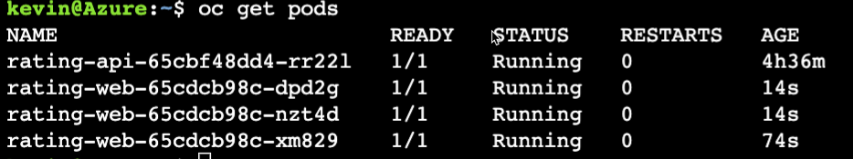
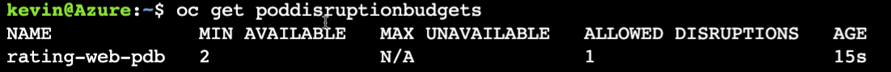
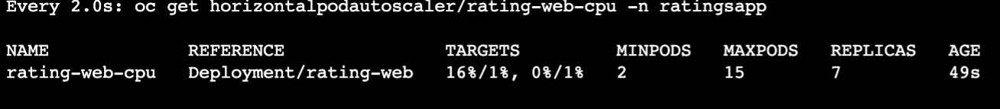
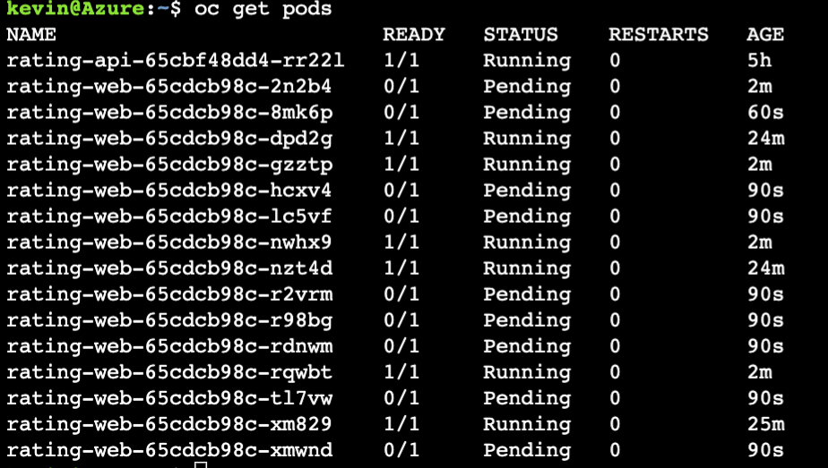
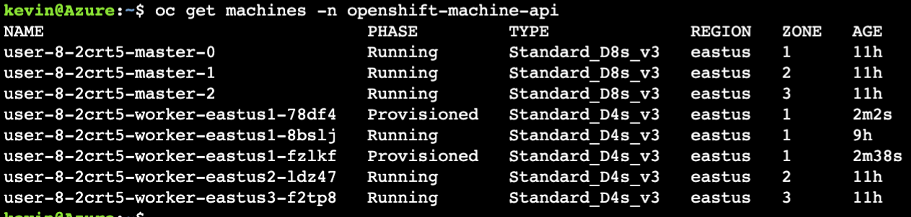
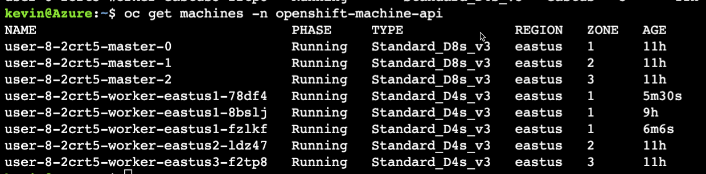
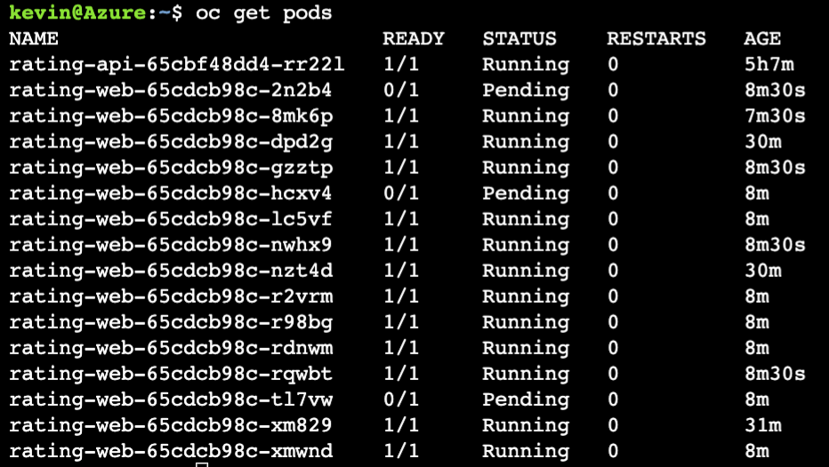
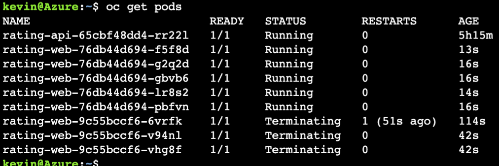
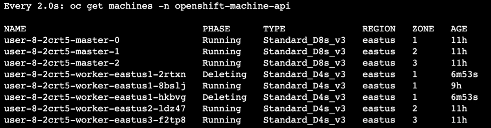
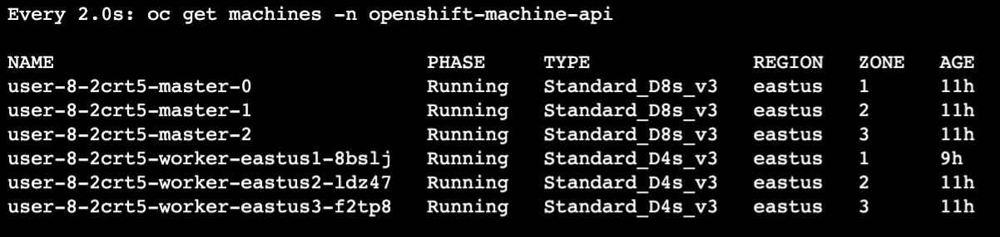

# Make Application Resilient 
In this section of the workshop, we will deploy an application to an ARO cluster, Ensure the application is resilient to node failure and scale when under load.

# Set resource limits
This first thing we need to do when it comes to scaling is set resource limits and requests, which also happens to be best practices when it comes to Kubernetes.

We will start by creating very large resource requests so the horizontal pod autoscaler that we will create next will kick in.

```bash
oc set resources deployment/rating-web \
   --limits=cpu=2,memory=2Gi \
   --requests=cpu=1,memory=1Gi
```


Right now the application is deployed inside one pod, and in case the worker running the pod crashes, the ReplicaSet object will register that the pod is down and recreate it on another node. You can scale the application to run on multiple pods using the following command

```bash
oc scale deployment/rating-web --replicas=3

oc get pods
```
Expected Output:


## Pod Disruption Budget
A Pod disruption Budget (PBD) allows you to limit the disruption to your application when its pods need to be rescheduled for upgrades or routine maintenance work on ARO nodes. In essence, it lets developers define the minimum tolerable operational requirements for a Deployment so that it remains stable even during a disruption. 

For example, rating-web deployed as part of the last step contains two replicas distributed evenly across two nodes. We can tolerate losing one pods but not two, so we create a PDB that requires a minimum of two replicas.

A PodDisruptionBudget object’s configuration consists of the following key partsi:

- A label selector, which is a label query over a set of pods.
- An availability level, which specifies the minimum number of pods that must be available simultaneously, either:
  - minAvailable is the number of pods must always be available, even during a disruption.
  - maxUnavailable is the number of pods can be unavailable during a disruption.


!!! note
    A maxUnavailable of 0% or 0 or a minAvailable of 100% or equal to the number of replicas is permitted but can block nodes from being drained.


Create a PDB by running the following.
```bash
cat <<EOF | oc apply -f -
apiVersion: policy/v1
kind: PodDisruptionBudget
metadata:
  name: rating-web-pdb
spec:
  minAvailable: 2
  selector:
    matchLabels:
      deployment: rating-web
EOF
```

After creating PDB, OpenShift API will ensure two pods of ```rating-web``` is running all the time while cluster is going through upgrade.

Check the status of PBD
```
oc get poddisruptionbudgets
```
Expected Output:

## Horizontal Pod Autoscaler (HPA)

As a developer, you can use a horizontal pod autoscaler (HPA) to specify how OpenShift Container Platform should automatically increase or decrease the scale of a replication controller or deployment configuration, based on metrics collected from the pods that belong to that replication controller or deployment configuration. You can create an HPA for any any deployment, deployment config, replica set, replication controller, or stateful set.

In this exercise we will scale frontend application based either CPU or Memory utilization.  We will set the thresholds initially to be very small and and the number of replicas to be large so the cluster autoscaler will also kick in.

* Scale out when average CPU utilization is greater than 1% of CPU or memory limit
* Maximum pods is 15
* Scale down to min replicas if utilization is lower than threshold for 60 sec

```bash
cat <<EOF | oc apply -f -
apiVersion: autoscaling/v2
kind: HorizontalPodAutoscaler
metadata:
  name: rating-web-cpu
  namespace: ratingsapp
spec:
  scaleTargetRef:
    apiVersion: apps/v1
    kind: Deployment
    name: rating-web
  minReplicas: 2
  maxReplicas: 15
  metrics:
    - type: Resource
      resource:
        name: memory
        target:
          type: Utilization
          averageUtilization: 1
    - type: Resource
      resource:
        name: cpu
        target:
          type: Utilization
          averageUtilization: 1
  behavior:
    scaleDown:
      stabilizationWindowSeconds: 60
      policies:
      - type: Percent
        value: 100
        periodSeconds: 15
EOF
```

Check HPA status
```
watch oc get horizontalpodautoscaler/rating-web-cpu -n ratingsapp
```

Watch the output for a while and watch the replicas scale up.  Hit Cntl-C to exit.

Expected Output:


Next check out the pods that are running:
Expected Output:


Notice that several pods are Pending.

This is the indication for the cluster autoscaler to start scaling nodes as no more rating-web pods can fit on the nodes we have.

Let's check the machines.
```bash
oc get machines -n openshift-machine-api
```
Expected Output


Wait a couple of minutes and run the same:
```bash
oc get machines -n openshift-machine-api
```
and you will see the machines have move to running from provisioned ... meaning the machines have been succesfully add as nodes to the cluster.

Expected Output:


Next, lets look at the pods again.
```bash
oc get pods
```

Notice that there are only a couple of pods left that are pending.  Why are there still pods pending?  Because the cluster autoscaler had a maximum setting of adding 2 additional nodes.

Expected output:


Finally, let's set the resource limits and horizonal pod autoscaled to something more reasonable which will then scale the cluster back down.
```bash
oc set resources deployment/rating-web \
   --limits=cpu=512m,memory=512Mi \
   --requests=cpu=128m,memory=128Mi
```

```bash
cat <<EOF | oc apply -f -
apiVersion: autoscaling/v2
kind: HorizontalPodAutoscaler
metadata:
  name: rating-web-cpu
  namespace: ratingsapp
spec:
  scaleTargetRef:
    apiVersion: apps/v1
    kind: Deployment
    name: rating-web
  minReplicas: 2
  maxReplicas: 5
  metrics:
    - type: Resource
      resource:
        name: memory
        target:
          type: Utilization
          averageUtilization: 60
    - type: Resource
      resource:
        name: cpu
        target:
          type: Utilization
          averageUtilization: 60
  behavior:
    scaleDown:
      stabilizationWindowSeconds: 60
      policies:
      - type: Percent
        value: 100
        periodSeconds: 15
EOF
```

Now that we have updated the HPA and Resource Limits, lets take a look at the pods.

```bash
oc get pods
```

watch the pods terminate and scale down 

Expected Output:


Next, let's watch the machines scale back down.

```bash
watch oc get machines -n openshift-machine-api
```

Watch as the machines go through the deleting phase and eventually disappear.  Hit Cntl-C ot escape:

Expected output of machines being deleted:


After a few minutes the two additional machines will no longer appear as the cluster has been scaled back down to it's original and optimal size.

