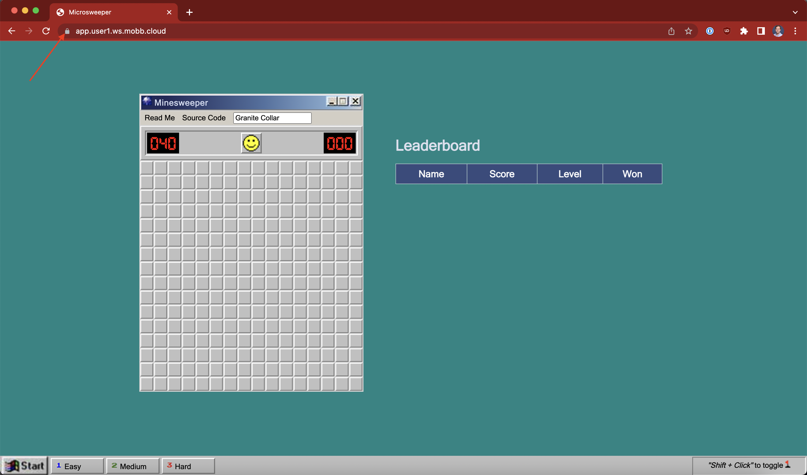

Up to this point, we have deployed the microsweeper app using the publicly available ingress controller that comes with our public Azure Red Hat OpenShift cluster. Now, we will continue our work to expose our application via Azure Front Door using the private ingress controller that we created earlier in the workshop. 

A quick diagram of the ARO and Azure Front Door integration:


There are several advantages of this approach:

* The ARO cluster and all the resources in your Azure account can be private.
* Azure Front Door operates at the edge so we are controlling traffic before it gets into your Azure account.
* Azure Front Door offers WAF and DDoS protection, certificate management, and SSL offloading, as well as many other security and performance related features.

As you can see in the diagram, Azure Front Door sits on the edge of the Microsoft network and is connected to the cluster via an Azure Private Link service.

1. First, let's verify that the ingress controller we created earlier in the workshop is still there. To do so, run the following command: 

    ```bash
    oc get IngressController private -n openshift-ingress-operator -o jsonpath='{.status.conditions}' | jq
    ```

    You'll see a lot of output, but the main thing you're looking for is that the deployment is available:

    ```json
    [...]
      {
        "lastTransitionTime": "2022-11-15T04:02:05Z",
        "message": "The deployment has Available status condition set to True",
        "reason": "DeploymentAvailable",
        "status": "True",
        "type": "DeploymentAvailable"
      },
    [...]
    ```

1. Since we've already configured Azure Front Door with a custom domain, we just need to tell OpenShift to expect traffic to come from our custom domain via a route. To create our route, run the following command:

    ```yaml
    cat <<EOF | oc apply -f -
    apiVersion: route.openshift.io/v1
    kind: Route
    metadata:
      labels:
        app.kubernetes.io/name: microsweeper-appservice
        app.kubernetes.io/version: 1.0.0-SNAPSHOT
        app.openshift.io/runtime: quarkus
        type: private
      name: microsweeper-appservice-fd
      namespace: microsweeper-ex
    spec:
      host: app.${AZ_USER}.ws.mobb.cloud
      to:
        kind: Service
        name: microsweeper-appservice
        weight: 100
        targetPort:
          port: 8080
      wildcardPolicy: None
    EOF
    ```

1. Now, we're ready to validate our Azure Front Door endpoint. To do so, we need to get the custom domain to use. To do so, run the following command:

    ```bash
    oc -n microsweeper-ex get route microsweeper-appservice-fd -o jsonpath='{.spec.host}'
    ```

    Then visit the URL presented in a new tab in your web browser (using HTTPS). For example, your output will look something similar to:

    ```bash
    app.user1.ws.mobb.cloud
    ```

    In that case, you'd visit `https://app.user1.ws.mobb.cloud` in your browser. 

Notice that the application is secured! This is done automatically for us by Front Door.
    


If you remember, one of the benefits of using Azure Front Door is that traffic is sent through and secured at the Microsoft edge, rather than your application. You can get some idea of how the traffic flows by looking at how the DNS for the custom domain is resolving:

```bash
nslookup app.${AZ_USER}.ws.mobb.cloud
```

Your output will look something similar to:

```bash
Server:         168.63.129.16
Address:        168.63.129.16#53

Non-authoritative answer:
app.user1.ws.mobb.cloud canonical name = user1-ilb-3686-fqchgscue9gqb7hq.z01.azurefd.net.
user1-ilb-3686-fqchgscue9gqb7hq.z01.azurefd.net canonical name = star-azurefd-prod.trafficmanager.net.
star-azurefd-prod.trafficmanager.net    canonical name = dual.part-0029.t-0009.t-msedge.net.
dual.part-0029.t-0009.t-msedge.net      canonical name = part-0029.t-0009.t-msedge.net.
Name:   part-0029.t-0009.t-msedge.net
Address: 13.107.246.57
Name:   part-0029.t-0009.t-msedge.net
Address: 13.107.213.57
Name:   part-0029.t-0009.t-msedge.net
Address: 2620:1ec:46::57
Name:   part-0029.t-0009.t-msedge.net
Address: 2620:1ec:bdf::57
```

Notice how the results show traffic coming from `*.t-msedge.net`.

Congratulations! You have now deployed a custom application, and exposed it to the internet using Azure Front Door.
