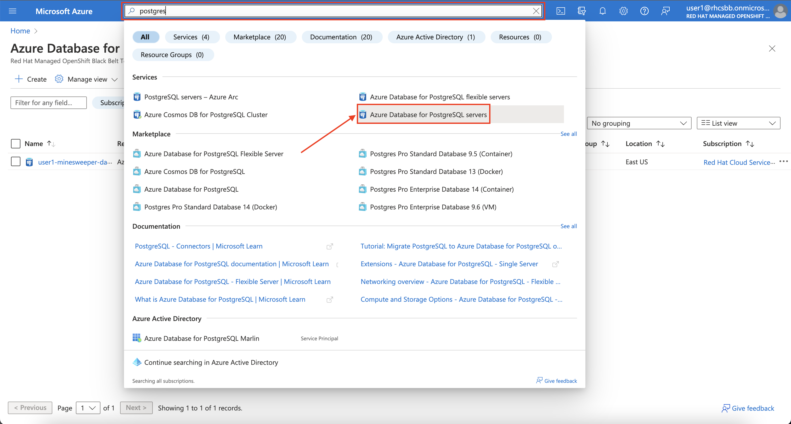
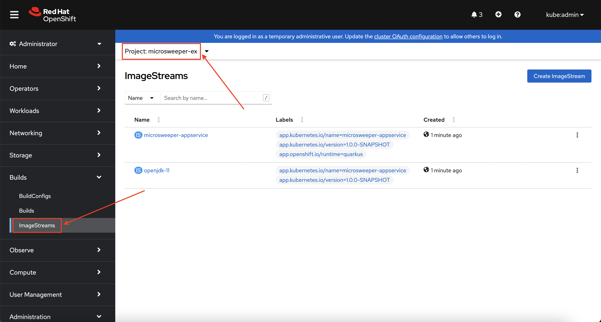
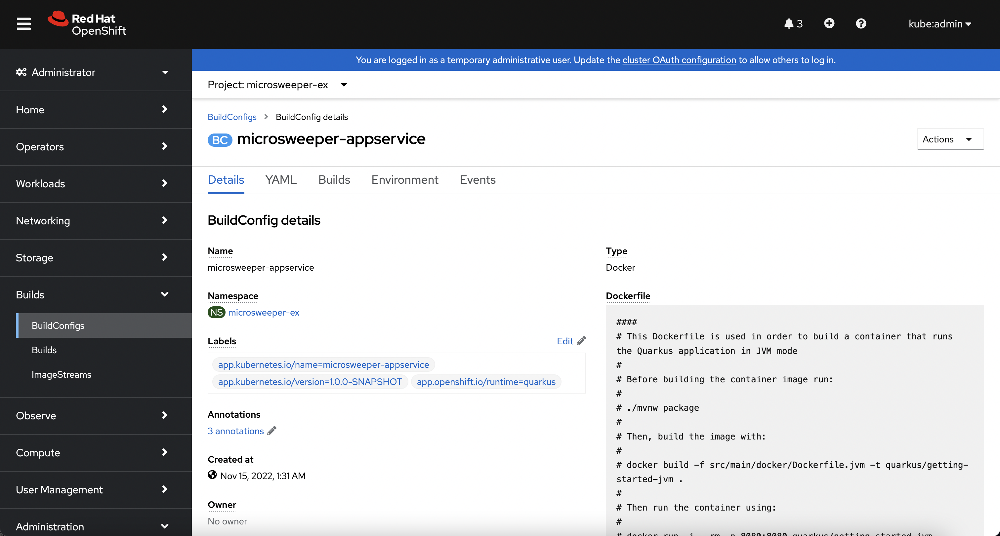
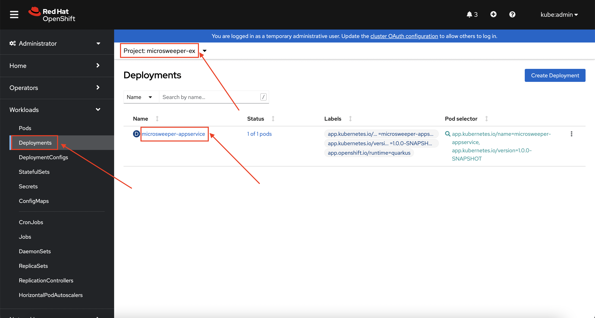
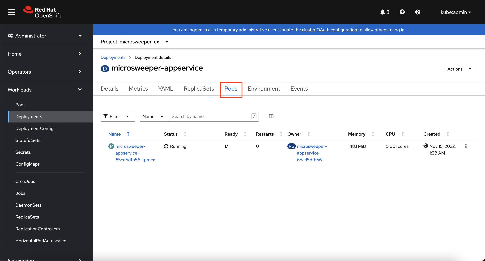
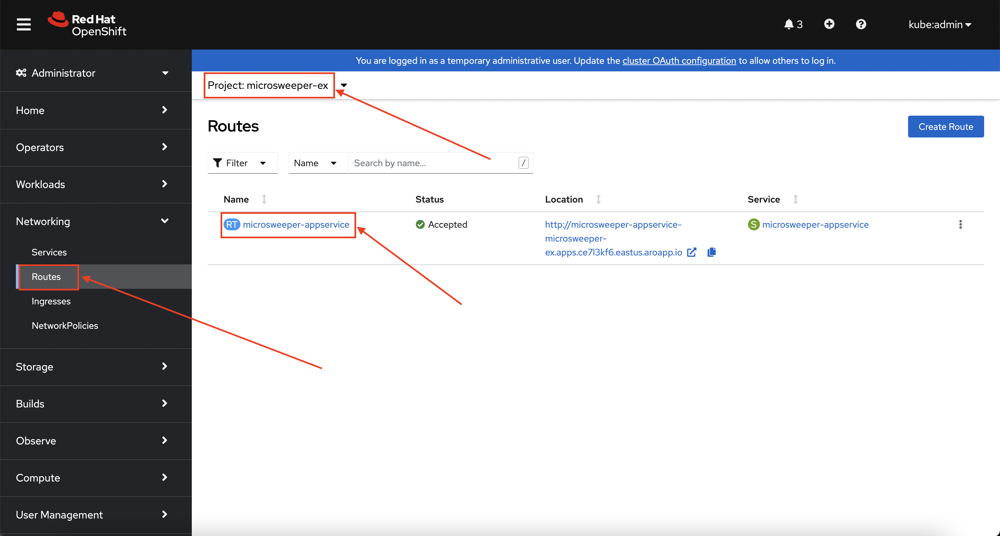
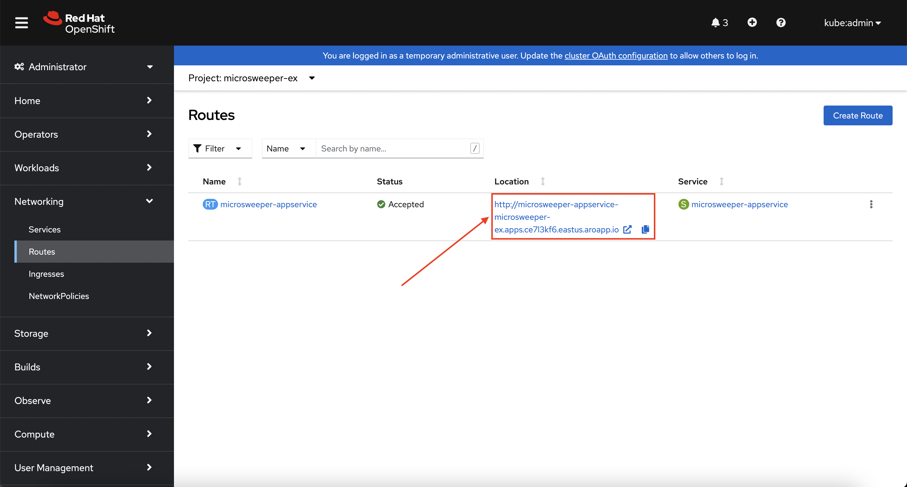
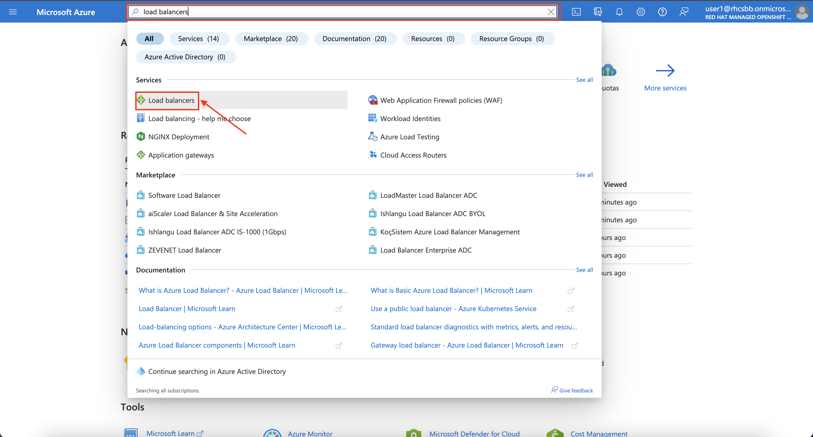
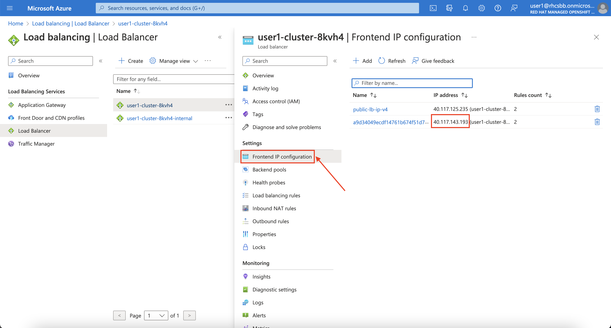

# Introduction

It's time for us to put our cluster to work and deploy a workload. We're going to build an example Java application, [microsweeper](https://github.com/redhat-mw-demos/microsweeper-quarkus/tree/ARO){:target="_blank"}, using [Quarkus](https://quarkus.io/){:target="_blank"} (a Kubernetes Native Java stack) and [Azure Database for PostgreSQL](https://azure.microsoft.com/en-us/products/postgresql/){:target="_blank"}. We'll then deploy the application to our Azure Red Hat OpenShift cluster, connect to the database using Azure Private Link, and securely expose this application over the internet using Azure Front Door. 

## Create Azure Database for PostgreSQL instance

To deploy our PostgreSQL database, we'll use the Azure Service Operator (ASO). 

1. First, let's create a namespace (also known as a project in OpenShift). To do so, run the following command:

    ```bash
    oc new-project microsweeper-ex
    ```

1. Next, let's inherit our existing Azure Resource Group (again) to hold Azure resources that we create with ASO. To do so, run the following commmand: 

    ```yaml
    cat <<EOF | oc apply -f -
    apiVersion: resources.azure.com/v1beta20200601
    kind: ResourceGroup
    metadata:
      name: "${AZ_RG}"
      namespace: microsweeper-ex
      annotations:
        serviceoperator.azure.com/reconcile-policy: skip
    spec:
      location: eastus
    EOF
    ```
    
1. Let's verify that our Azure Resource Group has been successfully inherited. To do so, run the following command:

    ```bash
    oc get resourcegroup.resources.azure.com/${AZ_RG}
    ```

    You should receive output that shows your resource group is *Ready* and *Succeeded*, similar to this:

    ```bash
    NAME       READY   REASON      MESSAGE
    user1-rg   True    Succeeded
    ```

1. Let's now create a secret for the database to use for the admin password. We'll re-use our random OpenShift password. To do so, run the following command:

    ```yaml
    cat <<EOF | oc apply -f -
    apiVersion: v1
    kind: Secret
    metadata:
      name: server-admin-pw
      namespace: microsweeper-ex
    stringData:
      password: "${OCP_PASS}"
    type: Opaque
    EOF
    ```

1. Next, let's create the Azure Postgres Flexible Server resource. To do so, run the following command:

    ```yaml
    cat <<EOF | oc apply -f -
    apiVersion: dbforpostgresql.azure.com/v1beta20210601
    kind: FlexibleServer
    metadata:
      name: "${AZ_USER}-minesweeper-database"
      namespace: microsweeper-ex
    spec:
      location: "${AZ_LOCATION}"
      owner:
        name: "${AZ_RG}"
      version: "13"
      sku:
        name: Standard_B1ms
        tier: Burstable
      administratorLogin: myAdmin
      administratorLoginPassword:
        name: server-admin-pw
        key: password
      storage:
        storageSizeGB: 32
    EOF
    ```

1. Now, let's create an Azure Postgres Flexible Server Configuration resource. To do so, run the following command:

    ```bash
    cat  <<EOF | oc apply -f -
    apiVersion: dbforpostgresql.azure.com/v1beta20210601
    kind: FlexibleServersConfiguration
    metadata:
      name: pgaudit
      namespace: microsweeper-ex
    spec:
      owner:
        name: "${AZ_USER}-minesweeper-database"
      azureName: pgaudit.log
      source: user-override
      value: READ
    EOF
    ```

1. Now, let's create a wide-open firewall rule for the database. To do so, run the following command:

    ```bash
    cat  <<EOF | oc apply -f -
    apiVersion: dbforpostgresql.azure.com/v1beta20210601
    kind: FlexibleServersFirewallRule
    metadata:
      name: wksp-fw-rule
      name: microsweeper-ex
    spec:
      owner:
        name: "${AZ_USER}-minesweeper-database"
      startIpAddress: 0.0.0.0
      endIpAddress: 255.255.255.255
    EOF
    ```

1. Next, let's create a Azure Postgres Flexible Server Database instance. To do so, run the following command: 

    ```bash
    cat  <<EOF | oc apply -f -
    apiVersion: dbforpostgresql.azure.com/v1beta20210601
    kind: FlexibleServersDatabase
    metadata:
      name: score
      namespace: microsweeper-ex
    spec:
      owner:
        name: "${AZ_USER}-minesweeper-database"
      charset: utf8
    EOF
    ```

    !!! warning

        It takes about 10 minutes for the database to become fully operational and running.

1. Next, let's monitor the creation process, run the following command:

    ```bash
    watch ~/bin/oc -n microsweeper-ex get flexibleservers.dbforpostgresql.azure.com ${AZ_USER}-minesweeper-database
    ```

    Your output will look like this:

    ```bash
    NAME                         READY   SEVERITY   REASON        MESSAGE
    user1-minesweeper-database   False   Info       Reconciling   The resource is in the process of being reconciled by the operator
    ```

    Eventually, the result will show:

    ```bash
    NAME                         READY   SEVERITY   REASON      MESSAGE
    user1-minesweeper-database   True               Succeeded
    ```

    !!! info

        Watch will refresh the output of a command every second. Hit CTRL and c on your keyboard to exit the watch command when you're ready to move on to the next part of the workshop.

1. (Optional) Once created, you can view the resource in the Azure Portal. To do so, search for "Postgres" in the search bar. 
    
    

    !!! warning

        The resource will not show up until after the PostgreSQL instance has been created. 

    Then, click on the the database name itself. 

    

1. Finally, let's check connectivity from our Cloud Shell to our database. To do so, run the following command:

    ```bash
    psql \
      "host=${AZ_USER}-minesweeper-database.postgres.database.azure.com port=5432 dbname=score user=myAdmin password=${OCP_PASS} sslmode=require" \
      -c "select now();"
    ```

    Your output should look similar to:

    ```bash
                  now              
    -------------------------------
    2022-11-15 06:39:13.903299+00
    (1 row)
    ```

## Build and deploy the Microsweeper app

Now that we've got a PostgreSQL instance up and running, let's build and deploy our application. 

1. First, let's clone the application from GitHub to our local Cloud Shell. To do so, run the following command:

    ```bash
    git clone https://github.com/rh-mobb/aro-workshop-app.git
    ```

1. Next, let's change directory into the newly cloned Git repository. To do so, run the following command:

    ```bash
    cd aro-workshop-app
    ```

1. Next, we will add the OpenShift extension to the Quarkus CLI. To do so, run the following command:

    ```bash
    quarkus ext add openshift
    ```

1. Now, we'll configure Quarkus to use the PostgreSQL database that we created earlier in this section. To do so, we'll create an `application.properties` file using by running the following command:

    ```xml
    cat <<EOF > ./src/main/resources/application.properties
    # Database configurations
    %prod.quarkus.datasource.db-kind=postgresql
    %prod.quarkus.datasource.jdbc.url=jdbc:postgresql://${AZ_USER}-minesweeper-database.postgres.database.azure.com:5432/score
    %prod.quarkus.datasource.jdbc.driver=org.postgresql.Driver
    %prod.quarkus.datasource.username=myAdmin
    %prod.quarkus.datasource.password=${OCP_PASS}
    %prod.quarkus.hibernate-orm.database.generation=drop-and-create
    %prod.quarkus.hibernate-orm.database.generation=update

    # OpenShift configurations
    %prod.quarkus.kubernetes-client.trust-certs=true
    %prod.quarkus.kubernetes.deploy=true
    %prod.quarkus.kubernetes.deployment-target=openshift
    %prod.quarkus.openshift.build-strategy=docker
    %prod.quarkus.openshift.expose=true
    %prod.quarkus.openshift.deployment-kind=Deployment
    %prod.quarkus.container-image.group=microsweeper-ex
    EOF
    ```

1. Now that we've provided the proper configuration, we will build our application. We'll do this using [source-to-image](https://github.com/openshift/source-to-image){:target="_blank"}, a tool built-in to OpenShift. To start the build and deploy, run the following command:

    ```bash
    quarkus build --no-tests
    ```

## Review 

Let's take a look at what this command did, along with everything that was created in your cluster. Return to your tab with the OpenShift Web Console. If you need to reauthenticate, follow the steps in the [Access Your Cluster](../setup/3-access-cluster/) section. 

### Container Images
From the Administrator perspective, expand *Builds* and then *ImageStreams*, and select the *microsweeper-ex* project.

. 

You will see two images that were created on your behalf when you ran the quarkus build command.  There is one image for `openjdk-11` that comes with OpenShift as a Universal Base Image (UBI) that the application will run under. With UBI, you get highly optimized and secure container images that you can build your applications with. For more information on UBI please read this [article](https://www.redhat.com/en/blog/introducing-red-hat-universal-base-image).

The second image you see is the the `microsweeper-appservice` image. This is the image for the application that was built automatically for you and pushed to the built-in container registry inside of OpenShift.

### Image Build

How did those images get built you ask? Back on the OpenShift Web Console, click on *BuildConfigs* and then the *microsweeper-appservice* entry.




When you ran the `quarkus build` command, this created the BuildConfig you can see here. In our quarkus settings, we set the deployment strategy to build the image using Docker. The Dockerfile file from the git repo that we cloned was used for this BuildConfig.

!!! info
  A build configuration describes a single build definition and a set of triggers for when a new build is created. Build configurations are defined by a BuildConfig, which is a REST object that can be used in a POST to the API server to create a new instance.

You can read more about BuildConfigs [here](https://docs.openshift.com/container-platform/latest/cicd/builds/understanding-buildconfigs.html)

Once the BuildConfig was created, the source-to-image process kicked off a Build of that BuildConfig. The build is what actually does the work in building and deploying the image.  We started with defining what to be built with the BuildConfig and then actually did the work with the Build.
You can read more about Builds [here](https://docs.openshift.com/container-platform/latest/cicd/builds/understanding-image-builds.html)

To look at what the build actually did, click on Builds tab and then into the first Build in the list.


On the next screen, explore around. Look specifically at the YAML definition of the build and the logs to see what the build actually did. If you build failed for some reason, the logs are a great first place to start to look at to debug what happened.


### Image Deployment
After the image was built, the source-to-image process then deployed the application for us. In the quarkus properties file, we specified that a deployment should be created. You can view the deployment under *Workloads* -> *Deployments*, and then click on the Deployment name.


Explore around the deployment screen, check out the different tabs, look at the YAML that was created.


Look at the pod the deployment created, and see that it is running.


The last thing we will look at is the route that was created for our application. In the quarkus properties file, we specified that the application should be exposed to the Internet.  When you create a Route, you have the option to specify a hostname. To start with, we will just use the default domain that comes with ARO (`useast.aroapp.io` in our case). In next section, we will expose the same application to a custom domain leveraging Azure Front Door.

You can read more about routes [in the Red Hat documentation](https://docs.openshift.com/container-platform/latest/networking/routes/route-configuration.html)

From the OpenShift Web Console menu, click on *Networking*->*Routes*, and the *microsweeper-appservice* route.


### Test the application
While in the route section of the OpenShift Web Console, click the URL under *Location*:


You can also get the the URL for your application using the command line:
```bash
oc -n microsweeper-ex get route microsweeper-appservice -o jsonpath='{.spec.host}'
```

### Application IP
Let's take a quick look at what IP the application resolves to. Back in your Cloud Shell environment, run the following command: 

```bash
nslookup $(oc -n microsweeper-ex get route microsweeper-appservice -o jsonpath='{.spec.host}')
```

The output of the command will look similar to this:

```bash
Server:         168.63.129.16
Address:        168.63.129.16#53

Non-authoritative answer:
Name:   microsweeper-appservice-microsweeper-ex.apps.ce7l3kf6.eastus.aroapp.io
Address: 40.117.143.193
```

Notice the IP address; can you guess where it comes from?

It comes from the ARO Load Balancer. In this workshop, we are using a public cluster which means the load balancer is exposed to the Internet. If this was a private cluster, you would have to have connectivity to the vNet ARO is running on. This could be via a VPN connection, Azure ExpressRoute, or something else.

To view the ARO load balancer, on the Azure Portal, search for "Load Balancers" in the search bar and click on the *Load balancers* service.


You will notice two load balancers, one that has -internal in the name and one that does not.  The `-internal` load balancer is used for the OpenShift API. The other load balancer (without the `-internal` suffix) in the name is use the public load balancer used for the default Ingress Controller. Click into the load balancer for applications.


On the next screen, click on Frontend IP configuration.  Notice the IP address of the 2nd load balancer on the list.  This IP address matches what you found with the nslookup command.


For the fun of it, we can also look at what backends this load balancer is connected to.


Next, click on the pool that ends in 443. 


Notice the *Backend pool*. This is the subnet that contains all the worker nodes. And the best part is all of this came with Azure Red Hat OpenShift out of the box!
