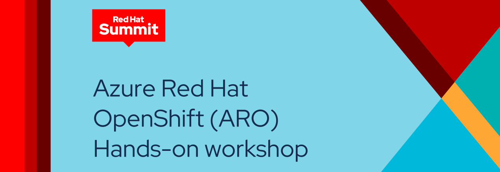

---
hide:
  - toc
---
{ align=center }

Welcome to the Azure Red Hat OpenShift (ARO) Hands-on workshop at Red Hat Summit and the OpenShift Commons Gathering! During this event, Red Hat Cloud Services experts will guide you through the ARO architecture and will answer your questions. 

**Who should attend:** This 2 hour long, in-person workshop is ideal for developers, architects, operators, and platform engineers who need a flexible and proven platform to build, deploy and scale applications.

**What to expect:** During the workshop, we will take you through a series of content to help you understand some of the concepts of deploying container-based applications on ARO and how to operate an ARO cluster. We will cover the following:

- Complete multiple day 2 operations tasks including: 
    * Configuring node and cluster scaling policies
    * Configuring managed upgrades
    * Configuring single-sign-on for the cluster using Azure Active Directory
    * Configuring metrics and log forwarding to Azure Files
- Deploy an application using native OpenShift tooling, and use labels for deterministic app placement on nodes.
- Deploy an application that uses an Azure Managed Database
- Make an application scalable and resistant to node failures and upgrades