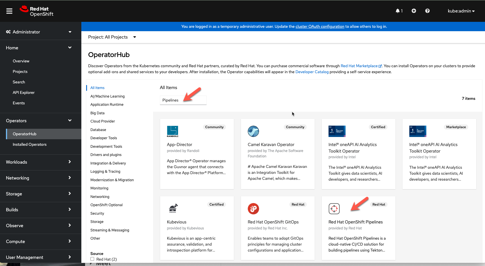
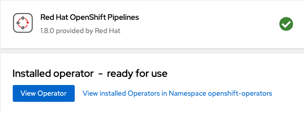

## Install the Red Hat OpenShift Pipeline Operator
1. Log in to the OpenShift Container Platform web console as a kubeadmin user you retrieved in the [Retieve Cluster Credentials Step](/aro-content/ops/1-3-get-credentials.md). 

2. In the OpenShift Container Platform web console, from the administrator view click **Operators → OperatorHub.**

3. Type the Pipelines into the filter box and search.  Click on the Red Hat OpenShift Pipelines Operator to install it.

4. Click **Install**.

5. On the **Install Operator** page for the Red Hat OpenShift Pipelines Operator, accept the default settings.

6. The operators takes about a minute to install and will when successful, you will see this screen. 
