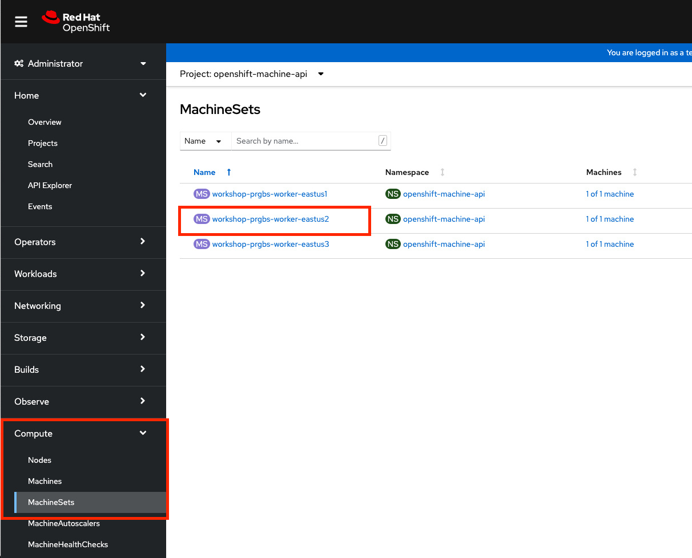

## Introduction

Labels are a useful way to select which nodes / machine sets that an application will run on. If you have a memory intensitve application, you may choose to use a memory heavy node type to place that application on. By using labels on the machinesets and selectors on your pod / deployment specification, you ensure thats where the application lands.

While you can directly add a label to a node it is not recommended as nodes can be restarted or recreated and the label would disappear. Therefore we need to label the MachineSet itself, however only new Machines created by the MachineSet will get the label, this means you will need to either scale the MachineSet down to zero then back up, or you can label the existing nodes.

### Use the Web Console to set a label for the MachineSet

Select "MachineSets" from the left menu.  You will see the list of machinesets.



Select a machine set that was not used in the previous autoscaling such as `ok0620-rq5tl-worker-westus21`

Click on the second tab **YAML**

Click into the text editor and find `spec.template.metadata.labels` add a key:value pair for the label you want.  In our example we can add a label `tier: frontend`. Click **Save**.


The already existing machines won't get this label but any new machines will. Rather than scale the MachineSet down to zero and back up which may disrupt your workloads you can write a quick script to label all machines that belong to the machineset

First set a variable containing the machineset you just modified

```bash
MACHINESET=<machineset name>
```

Next label each machine in that machineset

```bash
MACHINES=$(oc -n openshift-machine-api get machines -o name \
  -l "machine.openshift.io/cluster-api-machineset=$MACHINESET" | xargs)
oc label -n openshift-machine-api "${MACHINES}" tier=frontend
```

Click on one of the machines and you can see that the label is now there.


