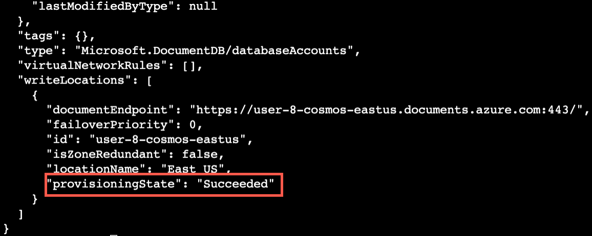
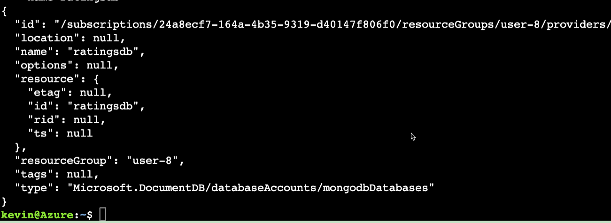

## Introduction

The appliction we will be deploying utilizes Azure Cosmos DB for the database.  The following instructions install the database.

```bash
COSMOSDB_NAME=$USERID-cosmos

az cosmosdb create \
  --name $COSMOSDB_NAME \
  --resource-group $USERID \
  --kind MongoDB \
  --server-version '4.0' \
  --enable-public-network true \
  --default-consistency-level Eventual
```

It can take around 5 minutes of the database to create.  The expected output should look like the following where you will see a message stating provisioning succeeded.



### The last step to create an instance of the cosmos database to use:

```bash
az cosmosdb mongodb database create \
  --account-name $COSMOSDB_NAME \
  --resource-group $USERID \
  --name ratingsdb
```

Expected output:
