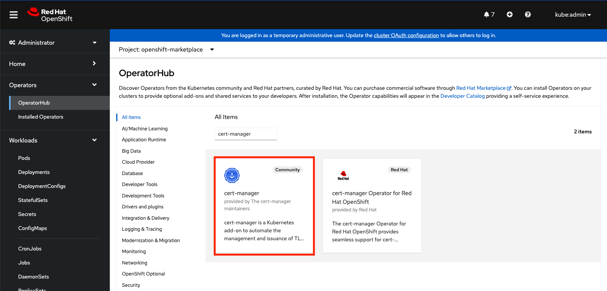
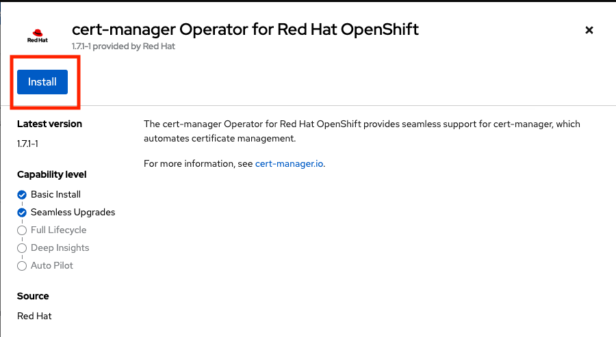
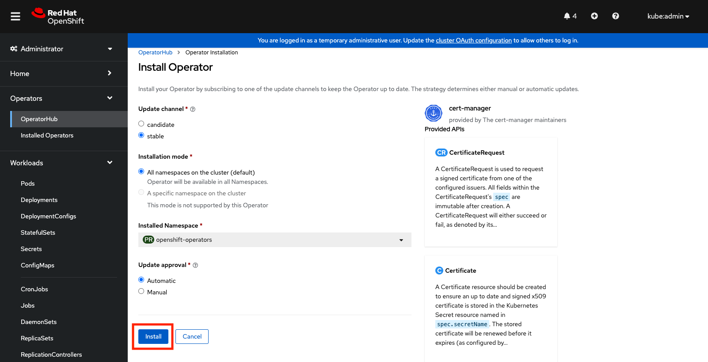

## Deploy Azure Service Operator
Azure Service Operator (ASO) is an open-source project by Microsoft Azure. ASO gives you the ability to provision and manage Azure resources such as compute, databases, resource groups, networking, etc. as objects in Kubernetes using declarative Kubernetes manifests.

ASO consists of:
- Custom Resource Definitions (CRDs) for each of the Azure services that a Kubernetes user can provision.
- A Kubernetes controller that manages the Azure resources represented by the user-specified Custom Resources. The controller attempts to synchronize the desired state in the user-specified Custom Resource with the actual state of that resource in Azure, creating it if it doesn't exist, updating it if it has been changed, or deleting it.


We deploy ASO on an ARO cluster to provision and manage Azure resources. To install ASO we need:

- An Azure Service Principal with Contributor permissions in the Azure Subscription. An Azure service principal is an identity created for use with applications, hosted services, and automated tools to access Azure resources.
    - This will be provided to you by the event staff
- A cert-manager operator instance. ASO relies on having the CRDs provided by cert-manager so it can request self-signed certificates. By default, cert-manager creates an Issuer of type SelfSigned, so it will work for ASO out-of-the-box.

###  Install and run ASO on your ARO cluster

#### Prepare your environment
First, set the required environment variables for your environment, be sure to replace the ClientID and Client Secret with the values you were provided, and set the correct Resource Group and Cluster Name:
 
```bash
AZURE_TENANT_ID="$(az account show -o tsv --query tenantId)"
AZURE_SUBSCRIPTION_ID="$(az account show -o tsv --query id)"
CLUSTER_NAME="workshop"
AZURE_RESOURCE_GROUP="workshop-test"
AZURE_CLIENT_ID=<your-client-id> # This is the appID from the service principal provided to you.
AZURE_CLIENT_SECRET=<your-client-secret> # This is the password from the service principal we created.
```

#### Install Cert Manager Operator

The cert-manager operator can easily be installed from the OpenShift Console OperatorHub. To install cert-manager, navigate to Operators > OperatorHub from the OpenShift console and search for `cert-manager`:



Click on the cert-manager tile to show the details page, and follow the install prompts:






#### Install the latest ASOv2 Helm Chart

```bash
helm repo add aso2 https://raw.githubusercontent.com/Azure/azure-service-operator/main/v2/charts
helm upgrade --install --devel aso2 aso2/azure-service-operator \
--create-namespace \
--namespace=azureserviceoperator-system \
--set azureSubscriptionID=$AZURE_SUBSCRIPTION_ID \
--set azureTenantID=$AZURE_TENANT_ID \
--set azureClientID=$AZURE_CLIENT_ID \
--set azureClientSecret=$AZURE_CLIENT_SECRET
```

You should see the following output immediately:

```bash
Release "aso2" has been upgraded. Happy Helming!
NAME: aso2
LAST DEPLOYED: Thu Nov  3 12:57:15 2022
NAMESPACE: azureserviceoperator-system
STATUS: deployed
REVISION: 4
TEST SUITE: None
```
   
!!! info
    It takes up to 5 min for ASO operator to be up and running

There is a pod in the azureserviceoperator-system namespace with two containers, when both are running the controller is installed and ready:

```bash
oc get po -n azureserviceoperator-system
```

```bash
NAME                                                READY   STATUS    RESTARTS   AGE
azureserviceoperator-controller-manager-5b4bfc59df-lfpqf   2/2     Running   0          24s
```
