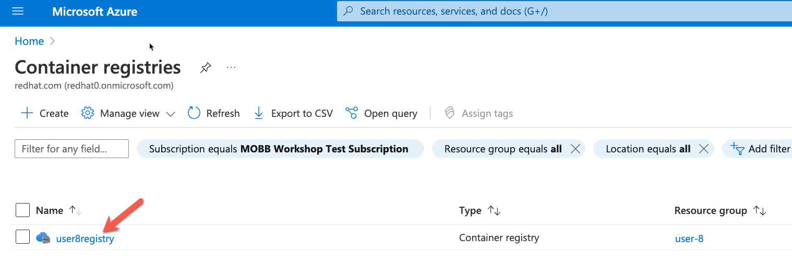

## Deploy Azure Container Registry through ASO
Azure Service Operator(ASO) is an open-source project by Microsoft Azure. ASO gives you the ability to provision and manages Azure resources such as compute, databases, resoure group, vnet, subnet,... within the Kubernetes plane by using familiar Kubernetes tooling and primitives. ASO consists of:
1. Custom Resource Definitions (CRDs) for each of the Azure services that a Kubernetes user can provision.

2. A Kubernetes controller that manages the Azure resources represented by the user-specified Custom Resources. The controller attempts to synchronize the desired state in the user-specified Custom Resource with the actual state of that resource in Azure, creating it if it doesn't exist, updating it if it has been changed, or deleting it.

In this task, we use ASO to provision Azure Container Registry which we will use to store our images.

1. **ResourceGroup**  
   *note this will not actually creat the resource group, it will simply register the Resource Group you are already using with ASO*

  ```bash
  envsubst <<EOF | oc apply -f -
  apiVersion: resources.azure.com/v1beta20200601
  kind: ResourceGroup
  metadata:
    name: $USERID
    namespace: default
  spec:
    location: eastus
  EOF
  ```


2. **Create an instace of the Azure Container Registry** 

  ```bash 
  REGISTRY_NAME=$(echo "$USERID"registry | tr -d -)

  envsubst <<EOF | oc apply -f -
  apiVersion: containerregistry.azure.com/v1beta20210901
  kind: Registry
  metadata:
    name: $REGISTRY_NAME
    namespace: default
  spec:
    location: eastus
    adminUserEnabled: true
    owner:
      name: $USERID
    publicNetworkAccess: Enabled
    sku:
      name: Basic
    zoneRedundancy: Disabled
  EOF
  ``` 

3. **Check that the Azure Portal that Azure Container Registry resource was created**

From the Azure Portal, search for container registries, and look for the registry you just created.
*Note: this can take a few minutes to show up in the Azure portal

