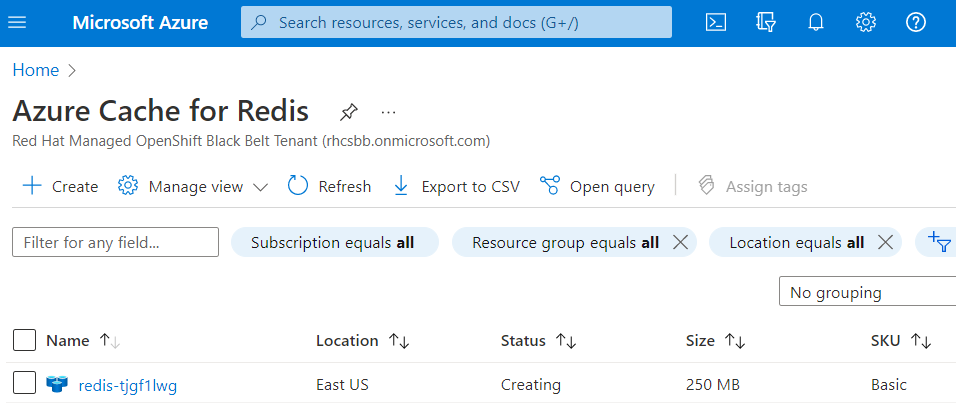

## Overview

Applications running on ARO often use other Azure services like databases, caching, message queues or storage. Using ASO, these services can be managed directly inside the cluster. In this task we will deploy an Azure Cache for Redis database that can be used by an application running on OpenShift. Azure Cache for Redis is a fully managed, in-memory cache that enables high-performance and scalable architectures.

To proceed with this task you will need to have completed the **Deploy Azure Service Operator** task from the previous section.

The Azure Voting App that will be deployed consists of a front end web-app that uses an Azure Cache for Redis instance to provide persistence of votes received for Cats and Dogs. The application interface has been built using Python / Flask.

### Create a project to use for the application

OpenShift uses Projects to separate application resources on the cluster. Create a project for the Azure Voting App:

```bash
oc new-project redis-demo
```

Allow the Redis App to run as any user:

```bash
oc adm policy add-scc-to-user anyuid -z redis-demo
```

Create an Azure Resource Group to hold project resources. Make sure the namespace matches the project name, and that the location is in the same region the cluster is:

```bash
cat <<EOF | oc apply -f -
apiVersion: resources.azure.com/v1beta20200601
kind: ResourceGroup
metadata:
  name: "${AZ_RG}"
  namespace: redis-demo
spec:
  location: eastus
EOF
```

### Deploy an Azure Cache for Redis Instance

The first step to deploying the application is to deploy the Redis cache. This also shows creating a random string as part of the hostname because the Azure DNS namespace is global, and a name like `sampleredis` is likely to be taken. Also make sure the location spec matches.

```bash
REDIS_HOSTNAME=redis-$(head -c24 < /dev/random | base64 | LC_CTYPE=C tr -dc 'a-z0-9' | cut -c -8)
cat <<EOF | oc apply -f -
apiVersion: cache.azure.com/v1beta20201201
kind: Redis
metadata:
  name: "${REDIS_HOSTNAME}"
  namespace: redis-demo
spec:
  location: eastus
  owner:
    name: "${AZ_RG}"
  sku:
    family: C
    name: Basic
    capacity: 0
  enableNonSslPort: true
  redisConfiguration:
    maxmemory-delta: "10"
    maxmemory-policy: allkeys-lru
  redisVersion: "6"
  operatorSpec:
    secrets:
      primaryKey:
        name: redis-secret
        key: primaryKey
      secondaryKey:
        name: redis-secret
        key: secondaryKey
      hostName:
        name: redis-secret
        key: hostName
      port:
        name: redis-secret
        key: port
EOF
```

This will take a couple of minutes to complete as well. Also note that there is typically a bit of lag between a resource being created and showing up in the Azure Portal.

You can view the resource being created in the Azure Portal by searching for "Redis"



You can watch the progress in the Cloud Shell by running

```bash
watch ~/bin/oc get redis
```

Eventually it will show

```{.text .no-copy}
NAME             READY   SEVERITY   REASON      MESSAGE
redis-tjgf1lwg   True               Succeeded
```

### Deploy the Azure Voting App

The Azure Voting App will be deployed from a pre-built container that is stored in the public Microsoft Azure Container Registry. It's environment variables are configured to use the URL of the Redis cache deployed in the last step, and a Kubernetes Secret that was created as part of the cache deployment.

The application is exposed internal to the cluster using a service on port 80, and is exposed externally using an OpenShift Route with TLS termination through a public facing Azure Load Balancer.

```bash
cat <<EOF | oc -n redis-demo apply -f -
apiVersion: apps/v1
kind: Deployment
metadata:
  name: azure-vote-front
spec:
  replicas: 1
  selector:
    matchLabels:
      app: azure-vote-front
  template:
    metadata:
      labels:
        app: azure-vote-front
    spec:
      containers:
      - name: azure-vote-front
        image: aroworkshop.azurecr.io/azure-vote:latest
        resources:
          requests:
            cpu: 100m
            memory: 128Mi
          limits:
            cpu: 250m
            memory: 256Mi
        ports:
        - containerPort: 8080
        env:
        - name: REDIS
          valueFrom:
            secretKeyRef:
              name: redis-secret
              key: hostName
        - name: REDIS_NAME
          value: "${REDIS_HOSTNAME}"
        - name: REDIS_PWD
          valueFrom:
            secretKeyRef:
              name: redis-secret
              key: primaryKey
---
apiVersion: v1
kind: Service
metadata:
  name: azure-vote-front
spec:
  ports:
  - port: 8080
    targetPort: 8080
  selector:
    app: azure-vote-front
---
apiVersion: route.openshift.io/v1
kind: Route
metadata:
  name: azure-vote
spec:
  port:
    targetPort: 8080
  to:
    kind: Service
    name: azure-vote-front
    weight: 100
  tls:
    insecureEdgeTerminationPolicy: Redirect
    termination: edge
  wildcardPolicy: None
EOF
```

### Access the Application

```bash
oc get route azure-vote
```

Browse to the URL provided by the previous command and validate that the app is working


