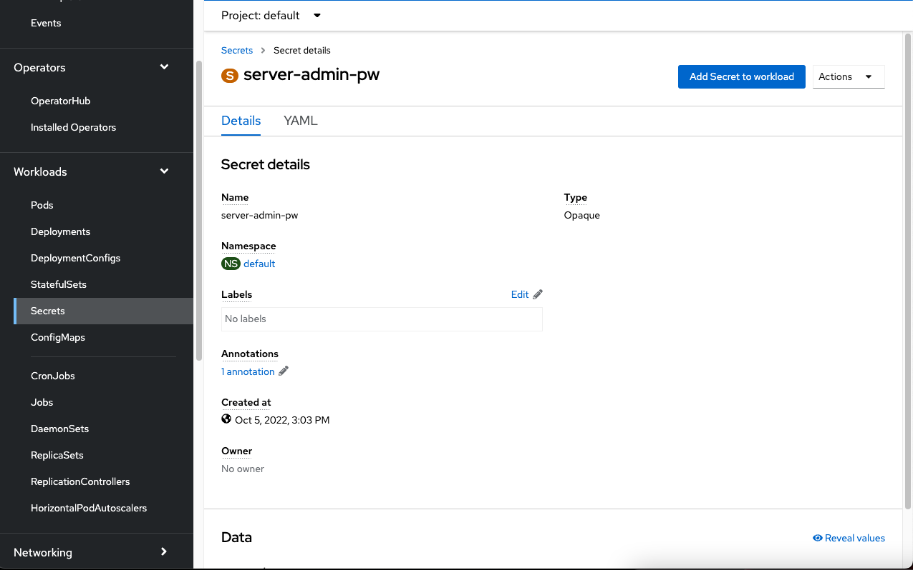
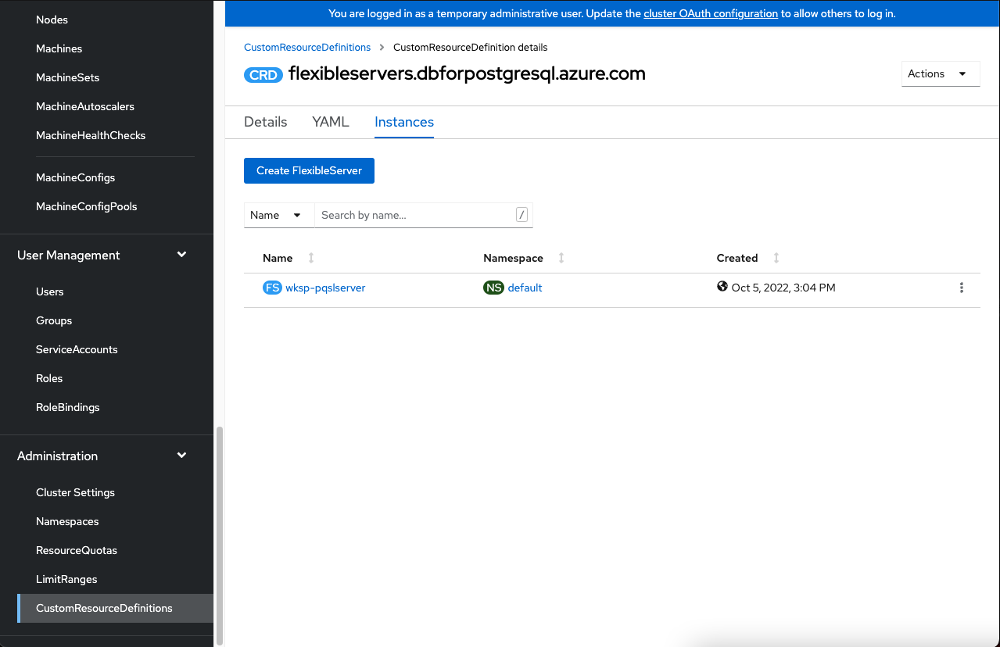
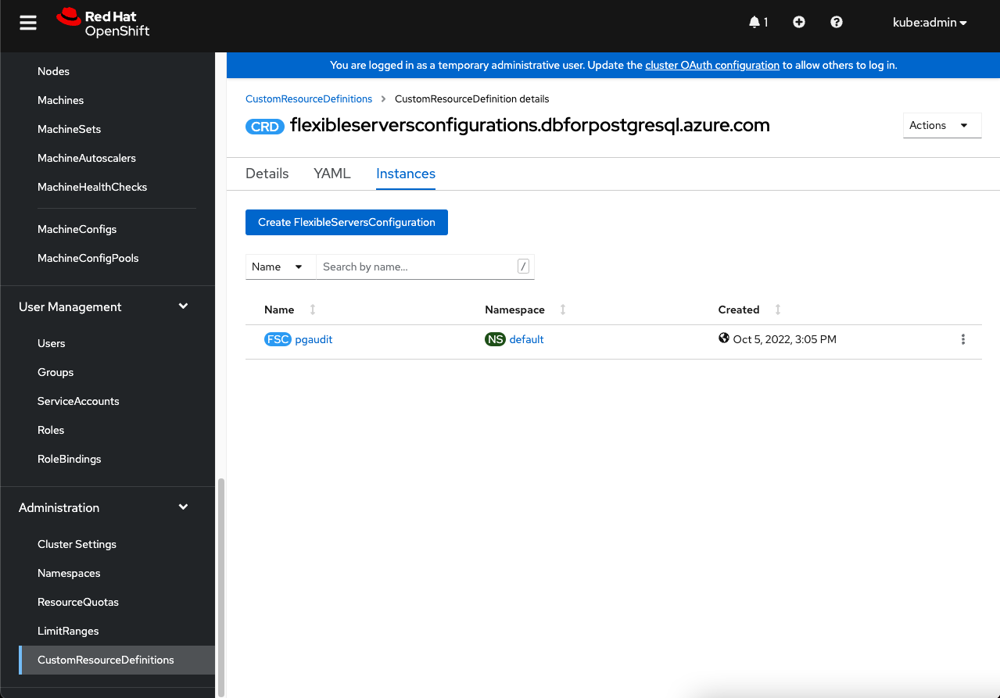

## Deploy Database for Minesweeper application through ASO
Azure Service Operator(ASO) is an open-source project by Microsoft Azure. ASO gives you the ability to provision and manages Azure resources such as compute, databases, resoure group, vnet, subnet,... within the Kubernetes plane by using familiar Kubernetes tooling and primitives. 

ASO consists of:

1. Custom Resource Definitions (CRDs) for each of the Azure services that a Kubernetes user can provision.
1. A Kubernetes controller that manages the Azure resources represented by the user-specified Custom Resources. The controller attempts to synchronize the desired state in the user-specified Custom Resource with the actual state of that resource in Azure, creating it if it doesn't exist, updating it if it has been changed, or deleting it.

In this task, we will use ASO to provision a PostgreSQL DB and connect applications to Azure resources from within Kubernetes

### Prerequisites

* an ARO cluster
* oc cli
* Azure Service Operator(ASO) operator v2
  
## Provision DB for Minesweeper APP

In order to provis  ion a PostgreSQL DB you need to create the following objects in your cluster:
 - ResourceGroup  
 - FlexibleServer  
 - FlexibleServersDatabase
 - FlexibleServersFirewallRule

1. **ResourceGroup**  **(if you don't have Resource Group)**
<<<<<<< HEAD

This resource group will be the resource container in azure that will hold the Database resources following azure best practices.

   ```
   cat <<EOF | oc apply -f -
   apiVersion: resources.azure.com/v1beta20200601
   kind: ResourceGroup
   metadata:
     name: wksp-rg
     namespace: default
   spec:
     location: eastus
   EOF
   ```

To view the resource group you can navigsate the azure portal to your resource groups or run one of these commands to check status or existance of the resource group

```
  az group exists --resource-group <resource_group>

  az group show --resource-group <resource_group>
```


2. **Provision PostgreSQL flexible server**

An Azure Flexible Server is a fully managed PostgreSQL DB as a service offering that provides a HA solution.

The following step will walk you through configuring a secret for the database, creating the server that will host the database, and then the firewall rules to allow external traffic to reach the DB. 

=======
    ```bash
    cat <<EOF | oc apply -f -
    apiVersion: resources.azure.com/v1beta20200601
    kind: ResourceGroup
    metadata:
      name: user1-wksp-rg
      namespace: default
    spec:
      location: eastus
    EOF
    ```
1. **Provision PostgreSQL flexible server**
>>>>>>> main

    1. **Create a secret for the DB server**
      
<<<<<<< HEAD
      **NOTE: You can update password in base64 format**
      ```
      cat <<EOF | oc apply -f -
      apiVersion : v1
      kind : Secret
      metadata : 
        name : server-admin-pw
        namespace : default
      data:
        password: aGFja2F0aG9uUGFzcw==
      type: Opaque
      EOF
      ```

    You should be able to see the secret in the cluster's web console

    

=======
       **NOTE: You can update password in base64 format**
       
        ```bash
        cat <<EOF | oc apply -f -
        apiVersion : v1
        kind : Secret
        metadata : 
          name : server-admin-pw
          namespace : default
        data:
          password: aGFja2F0aG9uUGFzcw==
        type: Opaque
        EOF
        ```
>>>>>>> main
            
    1. **Create DB server**
      
<<<<<<< HEAD
      Notice here the apiVersion denotes a custom resource definition that will be used as an YAMl representation of the Azure resource you want to create. The openshift controller will then that that YAML CRD and initate the creation of the resource with Msft Azure.  

      Heres a brief description of the fields in the manifest below
      
      * Owner - field is expected to be a reference to a resources.azure.com/ResourceGroup resource
      * Version - the version of the postgres server
      * SKU - denotes the sku info related to the properties of a server
      * administratorLogin - can only be specified when the server is creates and is the admin login name
      * administratorLoginPassword - the admin login password but can be reset after the server has been created
        * refers to the golang genruntime SecretReference type whos constructor requires a name string and key string that must exist in the same namespace as the resource
      

      ```
      cat <<EOF | oc apply -f -
      apiVersion: dbforpostgresql.azure.com/v1beta20210601
      kind: FlexibleServer
      metadata:
        name: wksp-pqslserver
        namespace: default
      spec:
        location: eastus
        owner:
          name: wksp-rg
        version: "13"
        sku:
          name: Standard_B1ms
          tier: Burstable
        administratorLogin: myAdmin # this needs to be the same as the user credentials for the appservice deployed later
        administratorLoginPassword: # This is the name/key of a Kubernetes secret in the same namespace
          name: server-admin-pw
          key: password
        storage:
          storageSizeGB: 32
      EOF
      ```

      Once created you can view it in the console under Administration > CustonResourceDefinitions > CRD_Name or by running this command 

      ```
        oc get crd -o json #filter for "FelxibleServer"
      ```

      


   3. **Create Server configuration**
      ```
      cat  <<EOF | oc apply -f -
      apiVersion: dbforpostgresql.azure.com/v1beta20210601
      kind: FlexibleServersConfiguration
      metadata:
        name: pgaudit
        namespace: default
      spec:
        owner:
          name: wksp-pqslserver
        azureName: pgaudit.log
        source: user-override
        value: READ
      EOF
      ```

      Looks like this in the console

      


   4. **Create a firewall rule for the database**

    In this manifest, the owner is expected to be a reference to a dbforpostgresql.azure.com/FlexibleServer resource, here it is the name of the server

    You can also see below the firewall rule parameters being passed through the controller and onto azure
      ```
      cat  <<EOF | oc apply -f -
      apiVersion: dbforpostgresql.azure.com/v1beta20210601
      kind: FlexibleServersFirewallRule
      metadata:
        name: wksp-fw-rule
        namespace: default
      spec:
        owner:
          name: wksp-pqslserver
        startIpAddress: 0.0.0.0
        endIpAddress: 255.255.255.255
      EOF
      ```


      


=======
        ```bash
        cat <<EOF | oc apply -f -
        apiVersion: dbforpostgresql.azure.com/v1beta20210601
        kind: FlexibleServer
        metadata:
          name: user1-minesweeper-database
          namespace: default
        spec:
          location: eastus
          owner:
            name: user1-wksp-rg
          version: "13"
          sku:
            name: Standard_B1ms
            tier: Burstable
          administratorLogin: myAdmin
          administratorLoginPassword: # This is the name/key of a Kubernetes secret in the same namespace
            name: server-admin-pw
            key: password
          storage:
            storageSizeGB: 32
        EOF
        ```
      
    1. **Create Server configuration**
        ```bash
        cat  <<EOF | oc apply -f -
        apiVersion: dbforpostgresql.azure.com/v1beta20210601
        kind: FlexibleServersConfiguration
        metadata:
          name: pgaudit
          namespace: default
        spec:
          owner:
            name: user1-minesweeper-database
          azureName: pgaudit.log
          source: user-override
          value: READ
        EOF
        ```
    1.  **Create a firewall rule for the database**
        ```bash
        cat  <<EOF | oc apply -f -
        apiVersion: dbforpostgresql.azure.com/v1beta20210601
        kind: FlexibleServersFirewallRule
        metadata:
          name: wksp-fw-rule
          namespace: default
        spec:
          owner:
            name: user1-minesweeper-database
          startIpAddress: 0.0.0.0
          endIpAddress: 255.255.255.255
        EOF
        ```
 
>>>>>>> main
**Note: it takes about 10 minutes for the database to be operational and running** 

 
1. **Create a sample DB**
<<<<<<< HEAD

  This oc apply command will create the DB Custom Resource Definition that will be pickedup by the controller and initiate the Database creation.

   ```
   cat  <<EOF | oc apply -f -
   apiVersion: dbforpostgresql.azure.com/v1beta20210601
   kind: FlexibleServersDatabase
   metadata:
     name: wksp-db
     namespace: default
   spec:
     owner:
       name: wksp-pqslserver
     charset: utf8
   
   EOF
   ```


**NOTE: provisioning this server takes about 10 min**
1. check provisioning is done
   ```
    while [ $(oc get flexibleservers.dbforpostgresql.azure.com wksp-pqslserver -o json | jq -r .status.conditions[0].type) != "Ready" ]; do echo "provisioning not complete"; break; done; echo "done"
   ```
   

2. **Check connection to DB server**
   ```
   psql "host=wksp-pqslserver.postgres.database.azure.com port=5432 dbname=wksp-db user=myAdmin password=<password> sslmode=require"
   ```
=======
    ```bash
    cat  <<EOF | oc apply -f -
    apiVersion: dbforpostgresql.azure.com/v1beta20210601
    kind: FlexibleServersDatabase
    metadata:
      name: score
      namespace: default
    spec:
      owner:
        name: user1-minesweeper-database
      charset: utf8
    
    EOF
    ```


1. **check provisioning is done**
    ```bash
    while [ $(oc get flexibleservers.dbforpostgresql.azure.com user1-minesweeper-database -o json | jq -r .status.conditions[0].type) != Ready ]; do  date; echo "wait";  sleep 10; done
    ```
   

1. **Check connection to DB server**
    ```bash
    psql "host=user1-minesweeper-database.postgres.database.azure.com port=5432 dbname=score user=myAdmin password=hackathonPass sslmode=require"
    ```


>>>>>>> main
