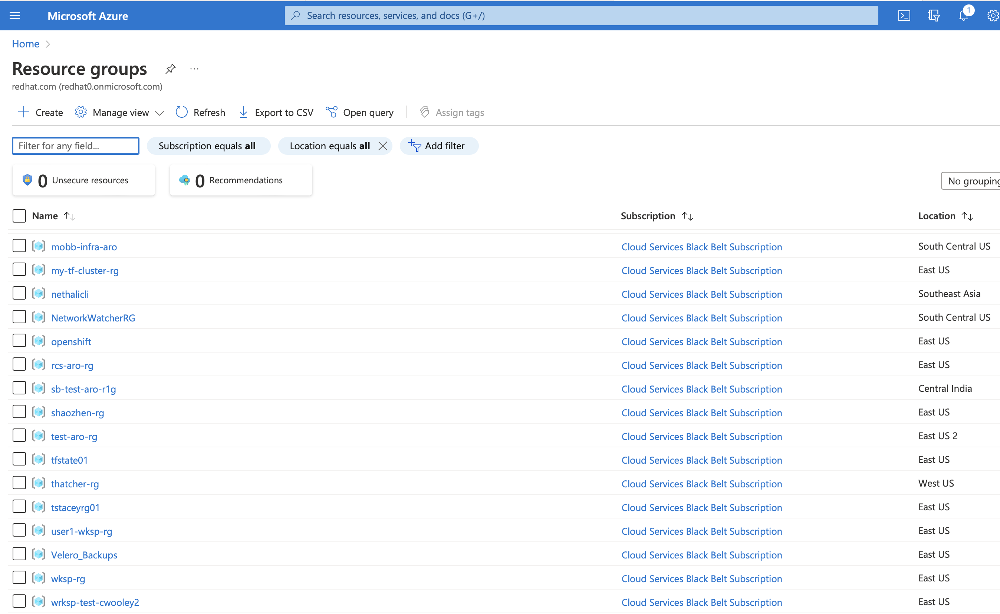
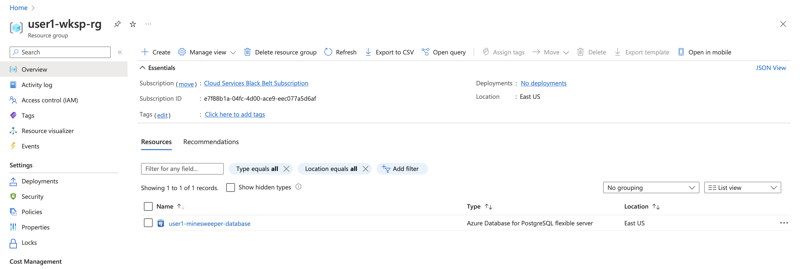

## Deploy a PostgreSQL Database using ASO

Applications running on ARO often use other Azure services like databases, message queues or storage.

### Prerequisites

* an ARO cluster
* oc cli
* Azure Service Operator(ASO) operator v2
* optional: client tool for Postgres - psql , pgadmin
  
## Provision DB for Minesweeper APP

to provision a PostgreSQL DB you need to create the following objects in your cluster:
 - ResourceGroup  
 - FlexibleServer  
 - FlexibleServersDatabase 
 - FlexibleServersFirewallRule

1. **ResourceGroup**  **(if you don't have Resource Group)**
    ```bash
    cat <<EOF | oc apply -f -
    apiVersion: resources.azure.com/v1beta20200601
    kind: ResourceGroup
    metadata:
      name: user1-wksp-rg
      namespace: default
    spec:
      location: eastus
    EOF
    ```

    check resource group in Azure portal 
    

2. **Provision PostgreSQL flexible server**

    1. **Create a secret for the DB server**
      
        **NOTE: You can update password in base64 format**
       
        ```bash
        cat <<EOF | oc apply -f -
        apiVersion : v1
        kind : Secret
        metadata : 
          name : server-admin-pw
          namespace : default
        data:
          password: cjNkaDR0MSE=
        type: Opaque
        EOF
        ```
            
    2. **Create DB server**
      
        ```bash
        cat <<EOF | oc apply -f -
        apiVersion: dbforpostgresql.azure.com/v1beta20210601
        kind: FlexibleServer
        metadata:
          name: user1-minesweeper-database
          namespace: default
        spec:
          location: eastus
          owner:
            name: user1-wksp-rg
          version: "13"
          sku:
            name: Standard_B1ms
            tier: Burstable
          administratorLogin: myAdmin
          administratorLoginPassword: # This is the name/key of a Kubernetes secret in the same namespace
            name: server-admin-pw
            key: password
          storage:
            storageSizeGB: 32
        EOF
        ```
      
    3. **Create Server configuration**
        ```bash
        cat  <<EOF | oc apply -f -
        apiVersion: dbforpostgresql.azure.com/v1beta20210601
        kind: FlexibleServersConfiguration
        metadata:
          name: pgaudit
          namespace: default
        spec:
          owner:
            name: user1-minesweeper-database
          azureName: pgaudit.log
          source: user-override
          value: READ
        EOF
        ```
    4.  **Create a firewall rule for the database**
        ```bash
        cat  <<EOF | oc apply -f -
        apiVersion: dbforpostgresql.azure.com/v1beta20210601
        kind: FlexibleServersFirewallRule
        metadata:
          name: wksp-fw-rule
          namespace: default
        spec:
          owner:
            name: user1-minesweeper-database
          startIpAddress: 0.0.0.0
          endIpAddress: 255.255.255.255
        EOF
        ```
 
**Note: it takes about 10 minutes for the database to be operational and running** 

 
1. **Create a sample DB**
    ```bash
    cat  <<EOF | oc apply -f -
    apiVersion: dbforpostgresql.azure.com/v1beta20210601
    kind: FlexibleServersDatabase
    metadata:
      name: score
      namespace: default
    spec:
      owner:
        name: user1-minesweeper-database
      charset: utf8
    
    EOF
    ```


1. **check provisioning is done**
    ```bash
    while [ $(oc get flexibleservers.dbforpostgresql.azure.com user1-minesweeper-database -o json | jq -r .status.conditions[0].status) != True ]; do  date; echo "wait";  sleep 10; done
    ```

    check server in Azure portal
       

1. **Check connection to DB server**
    ```bash
    psql "host=user1-minesweeper-database.postgres.database.azure.com port=5432 dbname=score user=myAdmin password=r3dh4t1! sslmode=require"
    ```


