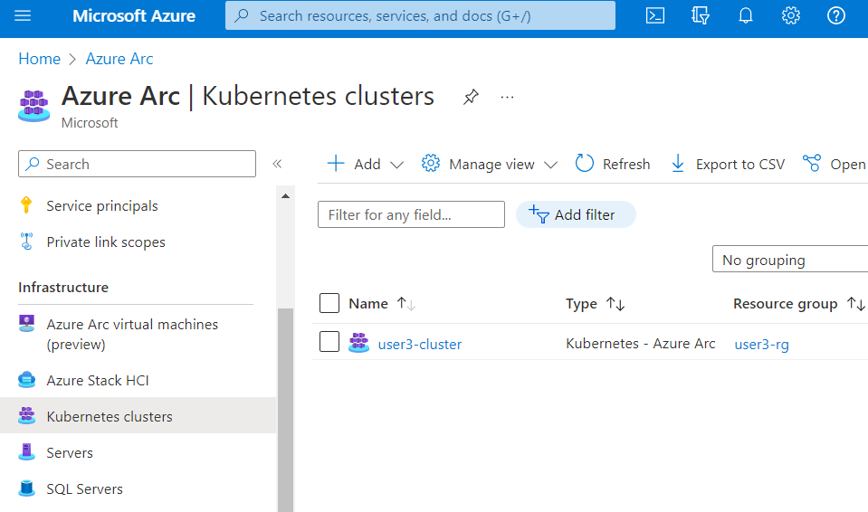

# Integrating Azure Arc with ARO

Azure Arc is a bridge that extends the Azure platform to help you build applications and services with the flexibility to run across datacenters, at the edge, and in multicloud environments. Develop cloud-native applications with a consistent development, operations, and security model. Azure Arc runs on both new and existing hardware, virtualization and Kubernetes platforms, IoT devices, and integrated systems.

In this section of the workshop, we will integrate ARO cluster with Azure Arc. When you connect a Kubernetes/OpenShift cluster with Azure Arc, it will:

- Be represented in Azure Resource Manager with a unique ID
- Be placed in an Azure subscription and resource group
- Receive tags just like any other Azure resource

Azure Arc for Kubernetes supports the following use cases for connected clusters:

- Connect Kubernetes running outside of Azure for inventory, grouping, and tagging.
- Deploy applications and apply configuration using GitOps-based configuration management.
- View and monitor your clusters using Azure Monitor for containers.
- Enforce threat protection using Microsoft Defender for Kubernetes.
- Apply policy definitions using Azure Policy for Kubernetes.
- Use Azure Active Directory for authentication and authorization checks on your cluster

## Prerequisites
* a public ARO cluster
* azure cli
* oc cli
* An identity (user or service principal) which can be used to log in to Azure CLI and connect your cluster to Azure Arc.


## Enable Extensions and Plugins
Before we can connect our ARO cluster to Azure ARC, we will need to the required Azure CLI extensions. Run the following commands in your Azure Cloud Shell.

```bash
az extension add --name "connectedk8s"
az extension add --name "k8s-configuration"
az extension add --name "k8s-extension"
```

## Connect ARC Your ARO Cluster

Now that the prerequisites are met, we can connect Azure ARC to our ARO Cluster by running the following command.

```bash
az connectedk8s connect --resource-group "${AZ_RG}" --name "${AZ_ARO}" \
  --distribution openshift --infrastructure auto
```


These commands take about 5 mins to complete. Upon the completion of the command you should see the following output and your cluster under Kubernetes - Azure Arc service in Azure Portal

```{.json .no-copy}
{
  "agentPublicKeyCertificate": "MIICCgKCAgEA...",
  "agentVersion": null,
  "connectivityStatus": "Connecting",
  "distribution": "OpenShift",
  "id": "/subscriptions/XXXXXX/resourceGroups/sazed-aro-cluster/providers/Microsoft.Kubernetes/connectedClusters/xxx-aro-cluster",
  "identity": {
    "principalId": "xxxx-xxxx-xxxx-xxxx",
    "tenantId": "xxxx-xxxx-xxxx-xxxx",
    "type": "SystemAssigned"
  },
  "infrastructure": "azure",
  "kubernetesVersion": null,
  "lastConnectivityTime": null,
  "location": "eastus",
  "managedIdentityCertificateExpirationTime": null,
  "name": "XXXX-aro-cluster",
  "offering": null,
  "provisioningState": "Succeeded",
  "resourceGroup": "XXXX-aro-cluster",
  "systemData": {
    "createdAt": "2022-09-15T19:23:40.540376+00:00",
    "createdBy": "XXXX@redhat.com",
    "createdByType": "User",
    "lastModifiedAt": "2022-09-15T19:23:40.540376+00:00",
    "lastModifiedBy": "XXXX@redhat.com",
    "lastModifiedByType": "User"
  },
  "tags": {},
  "totalCoreCount": null,
  "totalNodeCount": null,
  "type": "microsoft.kubernetes/connectedclusters"
}
```

After running the command, we need to grant the following permissions to the Azure ARC service account.

```bash
oc project azure-arc
oc adm policy add-scc-to-user privileged \
  system:serviceaccount:azure-arc:azure-arc-kube-aad-proxy-sa
```

In order for the permissions to take effect we need to restart the `kube-aad-proxy`

```bash
oc rollout restart deployment kube-aad-proxy
```

Wait for a few moments and you can check the pods in ```azure-arc``` namespace are running

```
oc get pods
```

```{.text .no-copy}
NAME                                         READY   STATUS    RESTARTS   AGE
cluster-metadata-operator-7dfd94949c-wtvjw   2/2     Running   0          4m47s
clusterconnect-agent-7d78db9859-wzthd        3/3     Running   0          4m47s
clusteridentityoperator-7b96bcb448-hzthh     2/2     Running   0          4m47s
config-agent-dbf66bbc7-r27qs                 2/2     Running   0          4m47s
controller-manager-67547546f-cmlb9           2/2     Running   0          4m47s
extension-manager-548c9d7d6b-jrrdn           2/2     Running   0          4m47s
flux-logs-agent-bb994c74f-m5gdc              1/1     Running   0          4m47s
kube-aad-proxy-6d9b66b9cd-g27xr              2/2     Running   0          3m16s
metrics-agent-7d794679c6-k4b7g               2/2     Running   0          4m47s
resource-sync-agent-bb79c44b8-5brjr          2/2     Running   0          4m47s
```

To check the status of clusters connected to Azure ARC, run the following command

```
 az connectedk8s list --resource-group $AZ_RG --output table
```

```{.text .no-copy}
Name                 Location    ResourceGroup
-------------------  ----------  -------------------
<< cluster name >>>  eastus      << resource group >>
```

## Enable Observability
In order to see ARO resources (namespaces, pods, services, etc) inside Azure Arc, you need to create a service account and provide the token to Azure Arc.

```bash
oc project azure-arc
oc create serviceaccount azure-arc-observability
oc create clusterrolebinding azure-arc-observability-rb \
  --clusterrole cluster-admin --serviceaccount azure-arc:azure-arc-observability
```

We now need to create a secret to store our token. This can be done by saving the below as a file on your Azure Cloud Shell.

```bash
cat <<EOF | oc apply -f -
apiVersion: v1
kind: Secret
metadata:
  name: azure-arc-observability-secret
  namespace: azure-arc
  annotations:
    kubernetes.io/service-account.name: azure-arc-observability
type: kubernetes.io/service-account-token
EOF
```

And finally we can obtain the token for Azure Arc by running the below.

```bash
TOKEN=$(oc get secret azure-arc-observability-secret -o jsonpath='{$.data.token}' | base64 -d | sed 's/$/\\n/g')
printf $TOKEN
```

In the Azure Portal search for "Azure Arc" and then select **Kubernetes Clusters** in the left menu, and then click on your cluster name.



Select Namespaces from the left side menu and paste the token in "Service account bearer token" input field.


Now you can see all of your ARO resources inside ARC UI.


You can now see and explore through the following OpenShift resources inside Azure ARC portal:

- Namespaces
- Workloads
- Services and Ingress
- Storage
- Configurations


## Access Secrets from Azure Key Vault
The Azure Key Vault (AKV) Provider for Secrets Store CSI Driver allows for the integration of Azure Key Vault as a secrets store with a Kubernetes cluster via a CSI volume. For Azure Arc-enabled Kubernetes clusters, you can install the Azure Key Vault Secrets Provider extension to fetch secrets.

### Install the Azure CLI Extension
Run the following to install the required Azure CLI extention.

```bash
az k8s-extension create --cluster-name "${AZ_ARO}" --resource-group "${AZ_RG}" \
  --cluster-type connectedClusters --name akvsecretsprovider \
  --extension-type Microsoft.AzureKeyVaultSecretsProvider
```

This command should return output similar to below.

```{.json .no-copy}
{
  "aksAssignedIdentity": null,
  "autoUpgradeMinorVersion": true,
  "configurationProtectedSettings": {},
  "configurationSettings": {},
  "customLocationSettings": null,
  "errorInfo": null,
  "extensionType": "microsoft.azurekeyvaultsecretsprovider",
  "id": "/subscriptions/e7f88b1a-04fc-4d00-ace9-eec077a5d6af/resourceGroups/sazed-aro-cluster/providers/Microsoft.Kubernetes/connectedClusters/sazed-aro-cluster-1/providers/Microsoft.KubernetesConfiguration/extensions/akvsecretsprovider",
  "identity": {
    "principalId": "xxxx-xxxx-xxxx-xxxx",
    "tenantId": null,
    "type": "SystemAssigned"
  },
  "installedVersion": null,
  "name": "akvsecretsprovider",
  "packageUri": null,
  "provisioningState": "Succeeded",
  "releaseTrain": "Stable",
  "resourceGroup": "sazed-aro-cluster",
  "scope": {
    "cluster": {
      "releaseNamespace": "kube-system"
    },
    "namespace": null
  },
  "statuses": [],
  "systemData": {
    "createdAt": "2022-09-15T20:45:47.152390+00:00",
    "createdBy": null,
    "createdByType": null,
    "lastModifiedAt": "2022-09-15T20:45:47.152390+00:00",
    "lastModifiedBy": null,
    "lastModifiedByType": null
  },
  "type": "Microsoft.KubernetesConfiguration/extensions",
  "version": "1.3.0"
}
```

Validate the extension installation

```bash
az k8s-extension show --cluster-type connectedClusters \
  --cluster-name "${AZ_ARO}" --resource-group "${AZ_RG}" \
  --name akvsecretsprovider
```

```{.json .no-copy}
{
  "aksAssignedIdentity": null,
  "autoUpgradeMinorVersion": true,
  "configurationProtectedSettings": {},
  "configurationSettings": {},
  "customLocationSettings": null,
  "errorInfo": null,
  "extensionType": "microsoft.azurekeyvaultsecretsprovider",
  "id": "/subscriptions/e7f88b1a-04fc-4d00-ace9-eec077a5d6af/resourceGroups/sazed-aro-cluster-1/providers/Microsoft.Kubernetes/connectedClusters/sazed-aro-cluster-1/providers/Microsoft.KubernetesConfiguration/extensions/akvsecretsprovider",
  "identity": {
    "principalId": "xxxx-xxxx-xxxx-xxxx",
    "tenantId": null,
    "type": "SystemAssigned"
  },
  "installedVersion": null,
  "name": "akvsecretsprovider",
  "packageUri": null,
  "provisioningState": "Succeeded",
  "releaseTrain": "Stable",
  "resourceGroup": "sazed-aro-cluster",
  "scope": {
    "cluster": {
      "releaseNamespace": "kube-system"
    },
    "namespace": null
  },
  "statuses": [],
  "systemData": {
    "createdAt": "2022-09-15T20:45:47.152390+00:00",
    "createdBy": null,
    "createdByType": null,
    "lastModifiedAt": "2022-09-15T20:45:47.152390+00:00",
    "lastModifiedBy": null,
    "lastModifiedByType": null
  },
  "type": "Microsoft.KubernetesConfiguration/extensions",
  "version": "1.3.0"
}
```

### Create Azure Key Vault and Secret

In order to use Azure Key Vault, we will first need to create the key vault and then create a secret in the cooresponding vault.

```bash
az keyvault create -n "${AZ_USER}" \
  --resource-group "${AZ_RG}" -l eastus
az keyvault secret set --vault-name "${AZ_USER}" \
  -n DemoSecret --value MyExampleSecret
```

### Provide identity to access Azure Key Vault

Currently, the Secrets Store CSI Driver on Arc-enabled clusters must be accessed through a service principal. Follow the steps below to provide an identity that can access your Key Vault.

```bash
oc create secret generic secrets-store-creds \
  --from-literal clientid="${AZURE_CLIENT_ID}" \
  --from-literal clientsecret="${AZURE_CLIENT_SECRET}"
oc label secret secrets-store-creds secrets-store.csi.k8s.io/used=true
```

Give your cluster read access to the secret

```bash
OID="$(az ad sp show --id ${AZURE_CLIENT_ID} --query '{id:id}' -o tsv)"
az keyvault set-policy --name "${AZ_USER}" \
  --object-id "${OID}" \
  --secret-permissions get
```

Create a SecretProviderClass for your Key vault resource

```bash
cat << EOF | oc apply -f -
apiVersion: secrets-store.csi.x-k8s.io/v1
kind: SecretProviderClass
metadata:
  name: akvprovider-demo
spec:
  provider: azure
  parameters:
    usePodIdentity: "false"
    keyvaultName: "${AZ_USER}"
    objects:  |
      array:
        - |
          objectName: DemoSecret
          objectType: secret
          objectVersion: ""
    tenantId: "${AZURE_TENANT_ID}"
EOF
```

Now we can create a pod using that can access the key vault secret

```yaml
cat << EOF | oc apply -f -
kind: Pod
apiVersion: v1
metadata:
  name: secret-store-pod
spec:
  containers:
    - name: busybox
      image: k8s.gcr.io/e2e-test-images/busybox:1.29
      command:
        - "/bin/sleep"
        - "10000"
      volumeMounts:
      - name: secrets-store-inline
        mountPath: "/mnt/secrets-store"
        readOnly: true
  volumes:
    - name: secrets-store-inline
      csi:
        driver: secrets-store.csi.k8s.io
        readOnly: true
        volumeAttributes:
          secretProviderClass: "akvprovider-demo"
        nodePublishSecretRef:
          name: secrets-store-creds
EOF
```

### Validate the secrets

After the pod starts, the mounted content at the volume path specified in your deployment YAML is available.

```bash
oc exec secret-store-pod -- cat /mnt/secrets-store/DemoSecret
```

You should see the following output

```{.text .no-copy}
MyExampleSecret
```

<!--
## Enable log aggregation
Azure Arc provides the ability to collect and aggregate logs from multiple sources. In order to collect logs from our ARO cluster and store it in Azure ARC, we will need to configure Azure monitor.

First, create Azure Log Analytics Workspace.

```bash
az monitor log-analytics workspace create \
  --resource-group "${AZ_RG}" --workspace-name loganalyticsworkspace
```
Navigate to the Azure ARC portal, select your ARO cluster, and click on ```Logs```.


Click on the ```Configure Azure Monitor``` button and select the workspace created in last step and click on configure.


Now you are able to see logs and metrics for your ARO cluster.
-->
<!--
## Monitor ARO cluster against Goverance Policies

Azure Policy extends Gatekeeper v3, an admission controller webhook for Open Policy Agent (OPA), to apply at-scale enforcements and safeguards on your clusters in a centralized, consistent manner.
Azure Policy makes it possible to manage and report on the compliance state of your Kubernetes clusters from one place.

The add-on enacts the following functions:

- Checks with Azure Policy service for policy assignments to the cluster.
- Deploys policy definitions into the cluster as constraint template and constraint custom resources.
- Reports auditing and compliance details back to Azure Policy service.

Azure policy plugin is enabled when you connect your ARO cluster with Azure ARC.


You can click on ```go to Azure Policies``` to look at the policies assigned to your cluster, check their status and attach more policies.


-->
