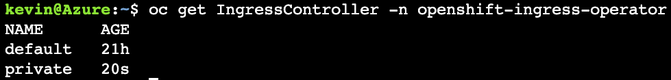

## Create a private Ingress Controller
As you will remember, when we create a cluster for this workshop, we use a public cluster where the API and default Applications endpoints are exposed to the Internet.  This was to elminate the need to VPN into our Azure environment.  To similate a private environment for the applications endpoint, we will craete a second Ingress Controller only exposed to the private network of our cluster.

Start by gathering a couple envionment variables from the default IngressController.

```bash
export INGRESSCERT=$(oc get IngressController default -n openshift-ingress-operator -o jsonpath='{.spec.defaultCertificate.name}')

export SELECTOR=ingresscontroller.operator.openshift.io/deployment-ingresscontroller=private

export DOMAIN=$(oc get IngressController default -n openshift-ingress-operator -o jsonpath='{.status.domain}' | sed "s/apps/apps2/g")
```

Now apply the following yaml file that will create a 2nd 'private' Ingress Controller.

``` bash
envsubst << EOF | oc apply -f -
apiVersion: v1
items:
- apiVersion: operator.openshift.io/v1
  kind: IngressController
  metadata:
    finalizers:
    - ingresscontroller.operator.openshift.io/finalizer-ingresscontroller
    generation: 2
    name: private
    namespace: openshift-ingress-operator
  spec:
    clientTLS:
      clientCA:
        name: ""
      clientCertificatePolicy: ""
    defaultCertificate:
      name: $INGRESSCERT
    httpCompression: {}
    httpEmptyRequestsPolicy: Respond
    httpErrorCodePages:
      name: ""
    replicas: 2
    tuningOptions: {}
    domain: $DOMAIN
    endpointPublishingStrategy:
      loadBalancer:
        scope: Internal
      type: LoadBalancerService
    observedGeneration: 2
    selector: $SELECTOR
    tlsProfile:
      ciphers:
      - ECDHE-ECDSA-AES128-GCM-SHA256
      - ECDHE-RSA-AES128-GCM-SHA256
      - ECDHE-ECDSA-AES256-GCM-SHA384
      - ECDHE-RSA-AES256-GCM-SHA384
      - ECDHE-ECDSA-CHACHA20-POLY1305
      - ECDHE-RSA-CHACHA20-POLY1305
      - DHE-RSA-AES128-GCM-SHA256
      - DHE-RSA-AES256-GCM-SHA384
      - TLS_AES_128_GCM_SHA256
      - TLS_AES_256_GCM_SHA384
      - TLS_CHACHA20_POLY1305_SHA256
      minTLSVersion: VersionTLS12
kind: List
EOF
```

### Check to make sure the private ingress controller was created.
```bash
oc get IngressController -n openshift-ingress-operator
```

Expected Output:
