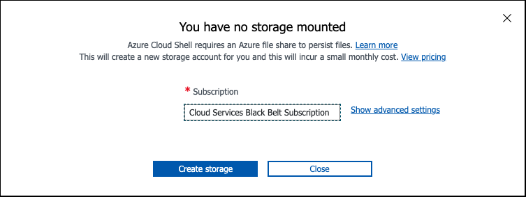

## Access Azure Portal and CLI

Access the Azure Portal through <https://portal.azure.com>

### Azure Credentials

Azure credentials will be provided to you by the organizing staff on the day of the event.

### Access CloudShell and Attach Persistent Storage

Azure Cloud Shell is an interactive, authenticated, browser-accessible shell for managing Azure resources.

To start Cloud Shell, launch it from the top navigation of the Azure Portal.

{ align=center }

Select the option to use Bash.

{ align=center }

When selecting a Cloud Shell region you must select a backing storage account co-located in the same region.

When the storage setup prompt appears, `Create storage'.

{ align=center }

When your shell is ready and you are at the bash prompt, run the following commands:

```
wget https://rh-mobb.github.io/aro-hackathon-content/assets/cloudshell-setup.sh

chmod +x cloudshell-setup.sh

./cloudshell-setup.sh

source .bashrc
```
