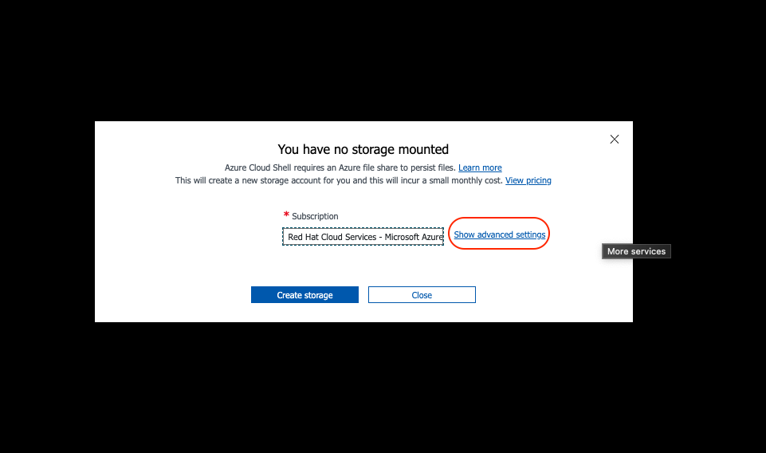
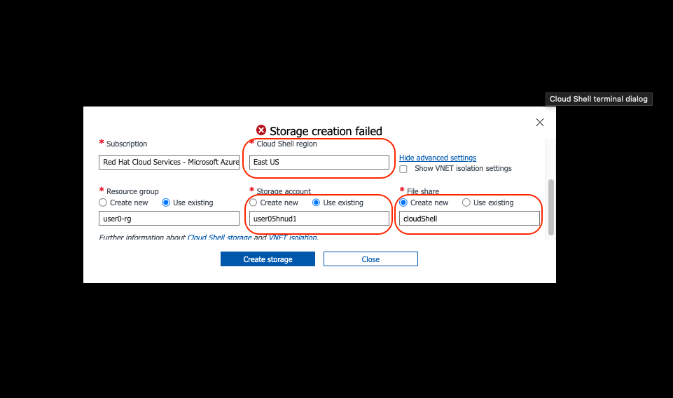

## Access Azure Portal and CLI

Access the Azure Portal through <https://portal.azure.com>

### Azure Credentials

Azure credentials will be provided to you by the organizing staff on the day of the event.

### What is Pre Created

* Resource Groups - name is associated with your user ID
* Cloud Storage - there is a storage account created for your User ID


### Logging into the Azure Portal

Once you are on the azure portal login page you will enter the username below

```
<yourUserID>@rhcsbb.onmicrosoft.com
```

For the password, your proctor will provide the credential


### Access CloudShell and Attach Persistent Storage

Azure Cloud Shell is an interactive, authenticated, browser-accessible shell for managing Azure resources.

To start Cloud Shell, launch it from the top navigation of the Azure Portal.

{ align=center }

Select the option to use Bash.

{ align=center }

When selecting a Cloud Shell region you must select a backing storage account co-located in the same region.

<<<<<<< Updated upstream
!!! info
    When the storage setup prompt appears, click **Show advanced settings** and enter `cloudshell` into the fileshare name then click **Create storage**.
=======
There are precreated storage accounts associated with your User ID

Select ~Advanced Settings~

{ align=center }

Make sure you have the ~Cloud Shell region~ set to ~East US~

Select the ~Use Existing~ radio button and select the storage account associated with your User ID

Fill in ~cloudshell~ for ~File Share~

Then Create Storage




>>>>>>> Stashed changes


When your shell is ready and you are at the bash prompt, run the following commands:

```
wget https://rh-mobb.github.io/aro-hackathon-content/assets/cloudshell-setup.sh

bash ./cloudshell-setup.sh

source .workshoprc
```
